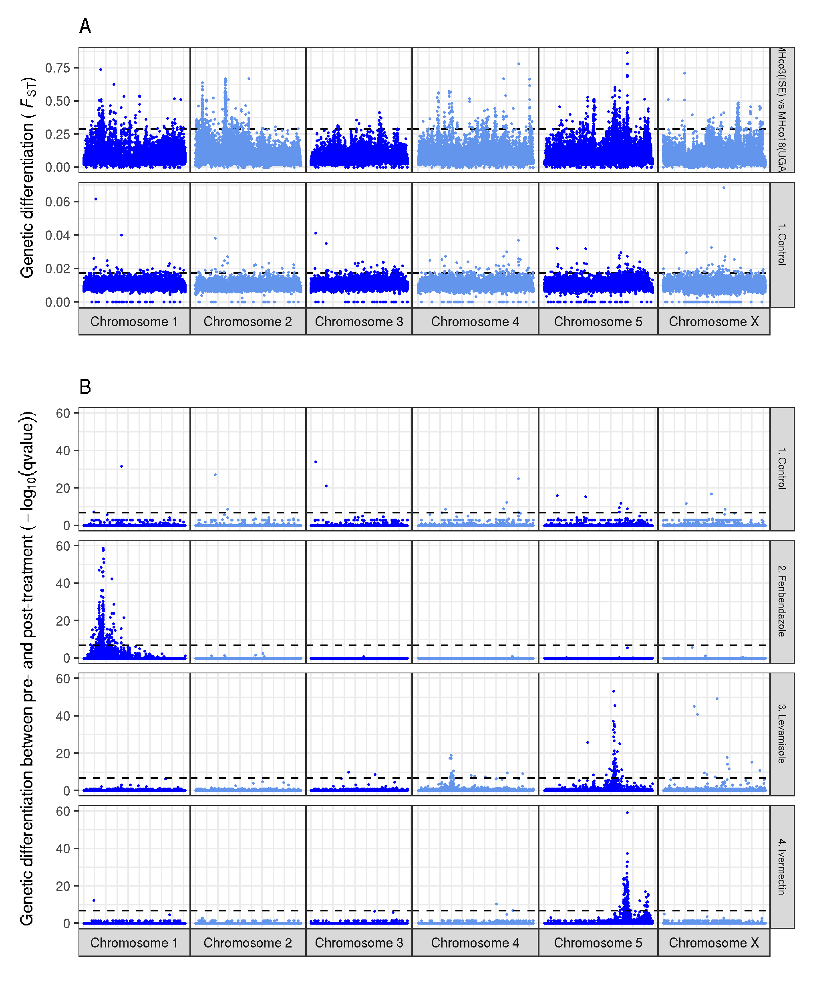

# XQTL: genome-wide plots of genetic differentiaiton
- code
     - code below describes most of the final analyses used to make figures in the manuscript.
     - some code describes hard links to places in my Sanger working environment, and so will need to be modified. However, this should be obvious and straightforward.
- raw data
     - raw data can be access via links in my FTP, which should allow the figures to be recreated.
     - the raw data is provides to facilitate open access and data reuse. If used, please cite the paper.


## Download raw data
```
# download data needed to make the figures
wget ftp://ftp.sanger.ac.uk/pub/project/pathogens/sd21/hcontortus_xqtl/BZ/XQTL_BZ.merged.fst
wget ftp://ftp.sanger.ac.uk/pub/project/pathogens/sd21/hcontortus_xqtl/CONTROL/XQTL_CONTROL.merged.fst
wget ftp://ftp.sanger.ac.uk/pub/project/pathogens/sd21/hcontortus_xqtl/IVM/XQTL_IVM.merged.fst
wget ftp://ftp.sanger.ac.uk/pub/project/pathogens/sd21/hcontortus_xqtl/LEV/XQTL_LEV.merged.fst
wget ftp://ftp.sanger.ac.uk/pub/project/pathogens/sd21/hcontortus_xqtl/PARENTS/XQTL_PARENTS.merged.fst
```


## Genome-wide: parental generation

Aim is to show genetic differentiation between the two parental strains,  MHco3(ISE) and MHco18(UGA)

```shell
# my working dir:
cd /nfs/users/nfs_s/sd21/lustre118_link/hc/XQTL/05_ANALYSIS/GENOMEWIDE
```


### R to plot
```R
# load required libraries
library(tidyverse)
library(patchwork)


# load and reformat the data
parents <- read.table("XQTL_PARENTS.merged.fst",  header = F)
parents <- parents[parents$V1 != "hcontortus_chr_mtDNA_arrow_pilon",  ]
parents <- dplyr::select(parents,  V1,  V2,  V7)
colnames(parents) <- c("CHR",  "POS",  "FST")
parents$LABEL <- "MHco3(ISE) vs MHco18(UGA)"
parents$ROW_ID <- 1:nrow(parents)
colnames(parents) <- c("CHR",  "POS",  "FST",  "LABEL",  "ROW_ID")

data <- parents

# calculate the genome wide significance per sample
data_gws <- data %>%
    group_by(LABEL) %>%
    summarise(GWS = mean(FST) + 3*sd(FST))

# chromosome colours
chr_colours <- c("blue", "cornflowerblue", "blue", "cornflowerblue", "blue", "cornflowerblue")

# make the plot
plot_a <-
     ggplot(data)+
     geom_hline(data = data_gws,  aes(yintercept = GWS),  linetype = "dashed",  col = "black") +
     geom_point(aes(ROW_ID * 5000,  FST,  colour = CHR,  group = LABEL),  size = 0.1) +
     ylim(0, 1) +
     labs(title = "A",  x = "Genomic position (bp)",  y = expression(paste("Genetic differentiation"," (",~italic(F)[ST],")"))) +
     scale_color_manual(values = chr_colours) +
     scale_x_continuous(breaks = seq(0,  3e8,  0.5e8), limits = c(0,  300e6)) +
     theme_bw() + theme(legend.position = "none",  text = element_text(size = 10), strip.text.y = element_text(size = 6)) +
     facet_grid(LABEL ~ .)

plot_a

ggsave("XQTL_genomewide_parents.png")
```


## Genome-wide: F3 generation before and after drug treatment

Aim is to show genetic differentiation between pre and post treatment F3 generation for each of the control,  benzimidazole,  levamisole,  and ivermectin XQTL datasets

| Group | Replicate Pair | Data column |
| --- | --- | --- |
| Control | 1:4 | V11 |
|   | 2:5 | V21 |
|   | 3:6 | V29 |
| BZ | 1:5 | V13 |
|    | 2:6 | V27 |
|    | 3:7 | V39 |
|    | 4:8 | V49 |
| LEV | Replicates
# 1:5 = V13
# 2:6 = V27
# 3:7 = V39
# 4:8 = V49

# IVM Replicates
# 1:5 = V13
# 2:6 = V27
# 3:7 = V39
# 4:8 = V49


```R
# load required libraries
library(tidyverse)
library(patchwork)


# control
control <- read.table("XQTL_CONTROL.merged.fst", header=F)
control <- control[control$V1!="hcontortus_chr_mtDNA_arrow_pilon", ]
control <- dplyr::select(control,  V1,  V2,  V11 , V21, V29)
control <- control %>% mutate(mean_FST = rowMeans(select(.,V11,V21,V29)))
control$LABEL <- "1. Control"
control$ROW_ID <- 1:nrow(control)
colnames(control) <- c("CHR",  "POS",  "FST_R1", "FST_R2", "FST_R3", "FST_MEAN",  "LABEL",  "ROW_ID")

# benzimidazole
bz <- read.table("XQTL_BZ.merged.fst", header = F)
bz <- bz[bz$V1 != "hcontortus_chr_mtDNA_arrow_pilon", ]
bz <- dplyr::select(bz,  V1,  V2,  V13 , V39, V49)
bz <- bz %>% mutate(mean_FST = rowMeans(select(.,V13,V39,V49)))
bz$LABEL <- "2. Benzimidazole"
bz$ROW_ID <- 1:nrow(bz)
colnames(bz) <- c("CHR",  "POS",  "FST_R1", "FST_R2", "FST_R3", "FST_MEAN",  "LABEL",  "ROW_ID")

data <- dplyr::bind_rows(control, bz)


# levamisole
lev <- read.table("XQTL_LEV.merged.fst", header = F)
lev <- lev[lev$V1 != "hcontortus_chr_mtDNA_arrow_pilon", ]
lev <- dplyr::select(lev,  V1,  V2,  V13 , V39, V49)
lev <- lev %>% mutate(mean_FST = rowMeans(select(.,V13)))
lev$LABEL <- "3. Levamisole"
lev$ROW_ID <- 1:nrow(lev)
colnames(lev) <- c("CHR",  "POS",  "FST_R1", "FST_R2", "FST_R3", "FST_MEAN",  "LABEL",  "ROW_ID")


data <- dplyr::bind_rows(data, lev)

#ivermectin
ivm <- read.table("XQTL_IVM.merged.fst", header = F)
ivm <- ivm[ivm$V1 != "hcontortus_chr_mtDNA_arrow_pilon", ]
ivm <- dplyr::select(ivm,  V1,  V2,  V13 , V39, V49)
ivm <- ivm %>% mutate(mean_FST = rowMeans(select(.,V13,V39,V49)))
ivm$LABEL <- "4. Ivermectin"
ivm$ROW_ID <- 1:nrow(ivm)
colnames(ivm) <- c("CHR",  "POS",  "FST_R1", "FST_R2", "FST_R3", "FST_MEAN",  "LABEL",  "ROW_ID")


data <- dplyr::bind_rows(data, ivm)


# genome wide signficance per sample
data_gws <- data %>%
    group_by(LABEL) %>%
    summarise(GWS = mean(FST_MEAN) + 3*sd(FST_MEAN))


# set the colours
chr_colours<-c("blue", "cornflowerblue", "blue", "cornflowerblue", "blue", "cornflowerblue")

# make the plot
plot_b <-
     ggplot(data) +
     geom_hline(data = data_gws,  aes(yintercept = GWS),  linetype = "dashed", col = "black") +
     geom_point(aes(ROW_ID * 5000,  FST_MEAN,  colour = CHR,  group = LABEL), size = 0.1) +
     #ylim(0, 0.12) +
     labs(title = "B", x = "Genomic position (bp)",  y = expression(paste("Genetic differentiation between pre- and post-treatment", " (",~italic(F)[ST],")")))+
     scale_color_manual(values = chr_colours) +
     scale_x_continuous(breaks = seq(0, 3e8, 0.5e8), limits = c(0, 300e6)) + ylim(0,0.15) +
     theme_bw() + theme(legend.position = "none", text = element_text(size=10)) +
     facet_grid(LABEL ~ .)


# combine the parental and XQTL plots into a single figure
plot_a + plot_b + plot_layout(ncol = 1,  heights = c(1, 4))

# save it
ggsave("genomewide_fst_plots.pdf", useDingbats = FALSE, width = 170, height = 200, units = "mm")
ggsave("genomewide_fst_plots.png")
```



## genome wide plots for F3 generation per replicate group

### Replicate 1
```bash
data_gws <- data %>%
    group_by(LABEL) %>%
    summarise(GWS = mean(FST_R1) + 3*sd(FST_R1))

ggplot(data) +
     geom_hline(data = data_gws,  aes(yintercept = GWS),  linetype = "dashed", col = "black") +
     geom_point(aes(ROW_ID * 5000,  FST_R1,  colour = CHR,  group = LABEL), size = 0.1) +
     #ylim(0, 0.12) +
     labs(title = "XQTL replicate set 1", x = "Genomic position (bp)",  y = expression(paste("Genetic differentiation between pre- and post-treatment", " (",~italic(F)[ST],")")))+
     scale_color_manual(values = chr_colours) +
     scale_x_continuous(breaks = seq(0, 3e8, 0.5e8), limits = c(0, 300e6)) +
     theme_bw() + theme(legend.position = "none", text = element_text(size=10)) +
     facet_grid(LABEL ~ ., scales="free_y")

ggsave("genomewide_fst_plots_R1_supplement.pdf", useDingbats = FALSE, width = 170, height = 200, units = "mm")
ggsave("genomewide_fst_plots_R1_supplement.png")
```


### replicate 2
```bash
data_gws <- data %>%
    group_by(LABEL) %>%
    summarise(GWS = mean(FST_R2) + 3*sd(FST_R2))

ggplot(data) +
          geom_hline(data = data_gws,  aes(yintercept = GWS),  linetype = "dashed", col = "black") +
          geom_point(aes(ROW_ID * 5000,  FST_R2,  colour = CHR,  group = LABEL), size = 0.1) +
          #ylim(0, 0.12) +
          labs(title = "XQTL replicate set 2", x = "Genomic position (bp)",  y = expression(paste("Genetic differentiation between pre- and post-treatment", " (",~italic(F)[ST],")")))+
          scale_color_manual(values = chr_colours) +
          scale_x_continuous(breaks = seq(0, 3e8, 0.5e8), limits = c(0, 300e6)) +
          theme_bw() + theme(legend.position = "none", text = element_text(size=10)) +
          facet_grid(LABEL ~ ., scales="free_y")

ggsave("genomewide_fst_plots_R2_supplement.pdf", useDingbats = FALSE, width = 170, height = 200, units = "mm")
ggsave("genomewide_fst_plots_R2_supplement.png")
```


### replicate 3
```bash
data_gws <- data %>%
    group_by(LABEL) %>%
    summarise(GWS = mean(FST_R3) + 3*sd(FST_R3))

          ggplot(data) +
               geom_hline(data = data_gws,  aes(yintercept = GWS),  linetype = "dashed", col = "black") +
               geom_point(aes(ROW_ID * 5000,  FST_R3,  colour = CHR,  group = LABEL), size = 0.1) +
               #ylim(0, 0.12) +
               labs(title = "XQTL replicate set 3", x = "Genomic position (bp)",  y = expression(paste("Genetic differentiation between pre- and post-treatment", " (",~italic(F)[ST],")")))+
               scale_color_manual(values = chr_colours) +
               scale_x_continuous(breaks = seq(0, 3e8, 0.5e8), limits = c(0, 300e6)) +
               theme_bw() + theme(legend.position = "none", text = element_text(size=10)) +
               facet_grid(LABEL ~ ., scales="free_y")

ggsave("genomewide_fst_plots_R3_supplement.pdf", useDingbats = FALSE, width = 170, height = 200, units = "mm")
ggsave("genomewide_fst_plots_R3_supplement.png")
```


## Genome wide plots of US field samples
### Susceptible farm 1 vs other farms
```R
# load libraries
library(ggplot2)
library(patchwork)

# chromosome colours
chr_colours <- c("blue", "cornflowerblue", "blue", "cornflowerblue", "blue", "cornflowerblue")

fst <-read.table("/nfs/users/nfs_s/sd21/lustre118_link/hc/XQTL/04_VARIANTS/US_FIELD/XQTL_US_FIELD.merged.fst",header=F)
fst <- fst[fst$V1!="hcontortus_chr_mtDNA_arrow_pilon",]

# susceptibles
plot_1 <-
     ggplot(fst,aes(1:nrow(fst)*10000,V21,colour = V1)) +
     geom_point(size=0.5)+
     ylim(0,1)+
     labs(title = "Farm 1 (ivermectin susceptible) vs Farm 9 (ivermectin susceptible)",  y = "Genetic differentiation (Fst)")+
     scale_color_manual(values = chr_colours) +
     scale_x_continuous(breaks = seq(0,  3e8,  0.5e8), limits = c(0,  300e6)) +
     theme_bw()+theme(legend.position = "none", text = element_text(size = 8), axis.text.x = element_blank(), axis.title.x = element_blank())

# UGA_S vs moderates
plot_2 <-
     ggplot(fst,aes(1:nrow(fst)*10000,V7,colour = V1))+
     geom_point(size=0.5)+
     ylim(0,1)+
     labs(title = "Farm 1 (ivermectin susceptible) vs Farm 2 (moderate ivermectin resistance)", y = "Genetic differentiation (Fst)")+
     scale_color_manual(values = chr_colours) +
     scale_x_continuous(breaks = seq(0,  3e8,  0.5e8), limits = c(0,  300e6)) +
     theme_bw()+theme(legend.position = "none", text = element_text(size = 8), axis.text.x = element_blank(), axis.title.x = element_blank())

plot_3 <-
     ggplot(fst,aes(1:nrow(fst)*10000,V9,colour = V1))+
     geom_point(size=0.5)+
     ylim(0,1)+
     labs(title = "Farm 1 (ivermectin susceptible) vs Farm 3 (moderate ivermectin resistance)",   y = "Genetic differentiation (Fst)")+
     scale_color_manual(values = chr_colours) +
     scale_x_continuous(breaks = seq(0,  3e8,  0.5e8), limits = c(0,  300e6)) +
     theme_bw()+theme(legend.position = "none", text = element_text(size = 8), axis.text.x = element_blank(), axis.title.x = element_blank())

plot_4 <-
     ggplot(fst,aes(1:nrow(fst)*10000,V11,colour = V1))+
     geom_point(size=0.5)+
     ylim(0,1)+
     labs(title = "Farm 1 (ivermectin susceptible) vs Farm 4 (moderate ivermectin resistance)",  y = "Genetic differentiation (Fst)")+
     scale_color_manual(values = chr_colours) +
     scale_x_continuous(breaks = seq(0,  3e8,  0.5e8), limits = c(0,  300e6)) +
     theme_bw()+theme(legend.position = "none", text = element_text(size = 8), axis.text.x = element_blank(), axis.title.x = element_blank())


# UGA_S vs high resistance
plot_5 <-
     ggplot(fst,aes(1:nrow(fst)*10000,V13,colour = V1))+
     geom_point(size=0.5)+
     ylim(0,1)+
     labs(title = "Farm 1 (ivermectin susceptible) vs Farm 5 (high ivermectin resistance)",  y = "Genetic differentiation (Fst)")+
     scale_color_manual(values = chr_colours) +
     scale_x_continuous(breaks = seq(0,  3e8,  0.5e8), limits = c(0,  300e6)) +
     theme_bw()+theme(legend.position = "none", text = element_text(size = 8), axis.text.x = element_blank(), axis.title.x = element_blank())

plot_6 <-
     ggplot(fst,aes(1:nrow(fst)*10000,V15,colour = V1))+
     geom_point(size=0.5)+
     ylim(0,1)+
     labs(title = "Farm 1 (ivermectin susceptible) vs Farm 6 (high ivermectin resistance)",  y = "Genetic differentiation (Fst)")+
     scale_color_manual(values = chr_colours) +
     scale_x_continuous(breaks = seq(0,  3e8,  0.5e8), limits = c(0,  300e6)) +
     theme_bw()+theme(legend.position = "none", text = element_text(size = 8), axis.text.x = element_blank(), axis.title.x = element_blank())

plot_7 <-
     ggplot(fst,aes(1:nrow(fst)*10000,V17,colour = V1))+
     geom_point(size=0.5)+
     ylim(0,1)+
     labs(title = "Farm 1 (ivermectin susceptible) vs Farm 7 (high ivermectin resistance)",  y = "Genetic differentiation (Fst)")+
     scale_color_manual(values = chr_colours) +
     scale_x_continuous(breaks = seq(0,  3e8,  0.5e8), limits = c(0,  300e6)) +
     theme_bw()+theme(legend.position = "none", text = element_text(size = 8), axis.text.x = element_blank(), axis.title.x = element_blank())

plot_8 <-
     ggplot(fst,aes(1:nrow(fst)*10000,V19,colour = V1))+
     geom_point(size=0.5)+
     ylim(0,1)+
     labs(title = "Farm 1 (ivermectin susceptible) vs Farm 8 (high ivermectin resistance)",   y = "Genetic differentiation (Fst)")+
     scale_color_manual(values = chr_colours) +
     scale_x_continuous(breaks = seq(0,  3e8,  0.5e8), limits = c(0,  300e6)) +
     theme_bw()+theme(legend.position = "none", text = element_text(size = 8), axis.text.x = element_blank(), axis.title.x = element_blank())

plot_9 <-
     ggplot(fst,aes(1:nrow(fst)*10000,V23,colour = V1))+
     geom_point(size=0.5)+
     ylim(0,1)+
     labs(title = "Farm 1 (ivermectin susceptible) vs Farm 10 (high ivermectin resistance)", x = "Chromosomal position (bp)",  y = "Genetic differentiation (Fst)")+
     scale_color_manual(values = chr_colours) +
     scale_x_continuous(breaks = seq(0,  3e8,  0.5e8), limits = c(0,  300e6)) +
     theme_bw()+theme(legend.position = "none", text = element_text(size = 8))

plot_1 + plot_2 + plot_3 + plot_4 + plot_5 + plot_6 + plot_7 + plot_8 + plot_9 + plot_layout(ncol=1)

ggsave("XQTL_SupplementaryFigure_USfarm1.pdf", useDingbats = FALSE, width = 170, height = 250, units = "mm")
ggsave("XQTL_SupplementaryFigure_USfarm1.png")
```


### Susceptible farm 9 vs other farms
```bash
plot_1 <-
     ggplot(fst,aes(1:nrow(fst)*10000,V21,colour = V1))+
     geom_point(size=0.5)+
     ylim(0,1)+
     labs(title = "Farm 1 (ivermectin susceptible) vs Farm 9 (ivermectin susceptible)",  y = "")+
     scale_color_manual(values = chr_colours) +
     scale_x_continuous(breaks = seq(0,  3e8,  0.5e8), limits = c(0,  300e6)) +
     theme_bw()+theme(legend.position = "none", text = element_text(size = 8), axis.text.x = element_blank(), axis.title.x = element_blank())

# UGA_S vs moderates
plot_2 <-
     ggplot(fst,aes(1:nrow(fst)*10000,V37,colour = V1))+
     geom_point(size=0.5)+
     ylim(0,1)+
     labs(title = "Farm 9 (ivermectin susceptible) vs Farm 2 (moderate ivermectin resistance)", y = "")+
     scale_color_manual(values = chr_colours) +
     scale_x_continuous(breaks = seq(0,  3e8,  0.5e8), limits = c(0,  300e6)) +
     theme_bw()+theme(legend.position = "none", text = element_text(size = 8), axis.text.x = element_blank(), axis.title.x = element_blank())

plot_3 <-
     ggplot(fst,aes(1:nrow(fst)*10000,V51,colour = V1))+
     geom_point(size=0.5)+
     ylim(0,1)+
     labs(title = "Farm 9 (ivermectin susceptible) vs Farm 3 (moderate ivermectin resistance)",   y = "")+
     scale_color_manual(values = chr_colours) +
     scale_x_continuous(breaks = seq(0,  3e8,  0.5e8), limits = c(0,  300e6)) +
     theme_bw()+theme(legend.position = "none", text = element_text(size = 8), axis.text.x = element_blank(), axis.title.x = element_blank())

plot_4 <-
     ggplot(fst,aes(1:nrow(fst)*10000,V63,colour = V1))+
     geom_point(size=0.5)+
     ylim(0,1)+
     labs(title = "Farm 9 (ivermectin susceptible) vs Farm 4 (moderate ivermectin resistance)",  y = "")+
     scale_color_manual(values = chr_colours) +
     scale_x_continuous(breaks = seq(0,  3e8,  0.5e8), limits = c(0,  300e6)) +
     theme_bw()+theme(legend.position = "none", text = element_text(size = 8), axis.text.x = element_blank(), axis.title.x = element_blank())


# UGA_S vs high resistance
plot_5 <-
     ggplot(fst,aes(1:nrow(fst)*10000,V73,colour = V1))+
     geom_point(size=0.5)+
     ylim(0,1)+
     labs(title = "Farm 9 (ivermectin susceptible) vs Farm 5 (high ivermectin resistance)",  y = "Genetic differentiation (Fst)")+
     scale_color_manual(values = chr_colours) +
     scale_x_continuous(breaks = seq(0,  3e8,  0.5e8), limits = c(0,  300e6)) +
     theme_bw()+theme(legend.position = "none", text = element_text(size = 8), axis.text.x = element_blank(), axis.title.x = element_blank())

plot_6 <-
     ggplot(fst,aes(1:nrow(fst)*10000,V81,colour = V1))+
     geom_point(size=0.5)+
     ylim(0,1)+
     labs(title = "Farm 9 (ivermectin susceptible) vs Farm 6 (high ivermectin resistance)",  y = "")+
     scale_color_manual(values = chr_colours) +
     scale_x_continuous(breaks = seq(0,  3e8,  0.5e8), limits = c(0,  300e6)) +
     theme_bw()+theme(legend.position = "none", text = element_text(size = 8), axis.text.x = element_blank(), axis.title.x = element_blank())

plot_7 <-
     ggplot(fst,aes(1:nrow(fst)*10000,V87,colour = V1))+
     geom_point(size=0.5)+
     ylim(0,1)+
     labs(title = "Farm 9 (ivermectin susceptible) vs Farm 7 (high ivermectin resistance)",  y = "")+
     scale_color_manual(values = chr_colours) +
     scale_x_continuous(breaks = seq(0,  3e8,  0.5e8), limits = c(0,  300e6)) +
     theme_bw()+theme(legend.position = "none", text = element_text(size = 8), axis.text.x = element_blank(), axis.title.x = element_blank())

plot_8 <-
     ggplot(fst,aes(1:nrow(fst)*10000,V91,colour = V1))+
     geom_point(size=0.5)+
     ylim(0,1)+
     labs(title = "Farm 9 (ivermectin susceptible) vs Farm 8 (high ivermectin resistance)",   y = "")+
     scale_color_manual(values = chr_colours) +
     scale_x_continuous(breaks = seq(0,  3e8,  0.5e8), limits = c(0,  300e6)) +
     theme_bw()+theme(legend.position = "none", text = element_text(size = 8), axis.text.x = element_blank(), axis.title.x = element_blank())

plot_9 <-
     ggplot(fst,aes(1:nrow(fst)*10000,V95,colour = V1))+
     geom_point(size=0.5)+
     ylim(0,1)+
     labs(title = "Farm 9 (ivermectin susceptible) vs Farm 10 (high ivermectin resistance)", x = "Chromosomal position (bp)",  y = "Genetic differentiation (Fst)")+
     scale_color_manual(values = chr_colours) +
     scale_x_continuous(breaks = seq(0,  3e8,  0.5e8), limits = c(0,  300e6)) +
     theme_bw()+theme(legend.position = "none", text = element_text(size = 8))

plot_1 + plot_2 + plot_3 + plot_4 + plot_5 + plot_6 + plot_7 + plot_8 + plot_9 + plot_layout(ncol=1)

ggsave("XQTL_SupplementaryFigure_USfarm2.pdf", useDingbats = FALSE, width = 170, height = 250, units = "mm")
ggsave("XQTL_SupplementaryFigure_USfarm2.png")
```


******
## License
<a rel="license" href="http://creativecommons.org/licenses/by/4.0/"></a><br />This work is licensed under a <a rel="license" href="http://creativecommons.org/licenses/by/4.0/">Creative Commons Attribution 4.0 International License</a>.
<!--

### other stuff that wasn't used but worth keeping


```R
R
library(ggplot2)

# get data
data <- read.table("XQTL_PARENTS.merged.fst", header=F)
data <- data[data$V1!="hcontortus_chr_mtDNA_arrow_pilon", ]

data$LABEL <- "Parents: MHco3(ISE) vs MHco18(UGA)"
# genome wide levels of significance


chr_colours<-c("blue", "cornflowerblue", "blue", "cornflowerblue", "blue", "cornflowerblue")

fst_column <- data$V7

genomewide_sig <- mean(fst_column)+(3*sd(fst_column))

plot_a <- ggplot(data)+
     geom_hline(yintercept=genomewide_sig,  linetype="dashed", col="black")+
     geom_point(aes(1:nrow(data)*5000,  fst_column,  colour = V1), size=0.1)+
     ylim(0, 1)+
     labs(title="A", x="Chromosome position (5 kbp window)",  y="Genetic differentiation (Fst)")+
     scale_color_manual(values=chr_colours)+
     scale_x_continuous(breaks=seq(0, 3e8, 0.5e8))+
     theme_bw()+theme(legend.position="none", text = element_text(size=10))+
     facet_grid(LABEL~.)


#ggsave("XQTL_parents_fst.pdf", useDingbats=FALSE, width=170, height=50, units="mm")

```

```R
R
library(ggplot2)

# get data
data <- read.table("XQTL_CONTROL.merged.fst", header=F)
data <- data[data$V1!="hcontortus_chr_mtDNA_arrow_pilon", ]
data$LABEL <- "Control"
# genome wide levels of significance


chr_colours<-c("blue", "cornflowerblue", "blue", "cornflowerblue", "blue", "cornflowerblue")

# Replicates
# 1:4 = V11
# 2:5 = V21
# 3:6 = V29

fst_column <- data$V11

genomewide_sig <- mean(fst_column)+(3*sd(fst_column))

plot_b <- ggplot(data)+
     geom_hline(yintercept=genomewide_sig,  linetype="dashed", col="black")+
     geom_point(aes(1:nrow(data)*5000,  fst_column,  colour = V1), size=0.1)+
     ylim(0, 0.1)+
     labs(title="B", x="Chromosome position (5 kbp window)",  y="Genetic differentiation (Fst)")+
     scale_color_manual(values=chr_colours)+
     scale_x_continuous(breaks=seq(0, 3e8, 0.5e8))+
     theme_bw()+theme(legend.position="none", text = element_text(size=10))+
     facet_grid(LABEL~.)

plot_b

```
```R
R
library(ggplot2)

# get data
data <- read.table("XQTL_BZ.merged.fst", header=F)
data <- data[data$V1!="hcontortus_chr_mtDNA_arrow_pilon", ]
data$LABEL <- "Benzimidazole"
# genome wide levels of significance


chr_colours<-c("blue", "cornflowerblue", "blue", "cornflowerblue", "blue", "cornflowerblue")

# Replicates
# 1:5 = V13
# 2:6 = V27
# 3:7 = V39
# 4:8 = V49


fst_column <- data$V13

genomewide_sig <- mean(fst_column)+(3*sd(fst_column))

plot_c <- ggplot(data)+
     geom_hline(yintercept=genomewide_sig,  linetype="dashed", col="black")+
     geom_point(aes(1:nrow(data)*5000,  fst_column,  colour = V1), size=0.1)+
     ylim(0, 0.1)+
     labs(title="C", x="Chromosome position (5 kbp window)",  y="Genetic differentiation (Fst)")+
     scale_color_manual(values=chr_colours)+
     scale_x_continuous(breaks=seq(0, 3e8, 0.5e8))+
     theme_bw()+theme(legend.position="none", text = element_text(size=10))+
     facet_grid(LABEL~.)
```

```R
R
library(ggplot2)

# get data
data <- read.table("XQTL_LEV.merged.fst", header=F)
data <- data[data$V1!="hcontortus_chr_mtDNA_arrow_pilon", ]
data$LABEL <- "Levamisole"
# genome wide levels of significance


chr_colours<-c("blue", "cornflowerblue", "blue", "cornflowerblue", "blue", "cornflowerblue")

# Replicates
# 1:5 = V13
# 2:6 = V27
# 3:7 = V39
# 4:8 = V49


fst_column <- data$V13

genomewide_sig <- mean(fst_column)+(3*sd(fst_column))

plot_d <- ggplot(data)+
     geom_hline(yintercept=genomewide_sig,  linetype="dashed", col="black")+
     geom_point(aes(1:nrow(data)*5000,  fst_column,  colour = V1), size=0.1)+
     ylim(0, 0.1)+
     labs(title="D", x="Chromosome position (5 kbp window)",  y="Genetic differentiation (Fst)")+
     scale_color_manual(values=chr_colours)+
     scale_x_continuous(breaks=seq(0, 3e8, 0.5e8))+
     theme_bw()+theme(legend.position="none", text = element_text(size=10))+
     facet_grid(LABEL~.)
```

## Ivermectin
```R
R
library(ggplot2)

# get data
data <- read.table("XQTL_IVM.merged.fst", header=F)
data <- data[data$V1!="hcontortus_chr_mtDNA_arrow_pilon", ]
data$LABEL <- "Ivermectin"
# genome wide levels of significance


chr_colours<-c("blue", "cornflowerblue", "blue", "cornflowerblue", "blue", "cornflowerblue")

# Replicates
# 1:5 = V13
# 2:6 = V27
# 3:7 = V39
# 4:8 = V49


fst_column <- data$V13

genomewide_sig <- mean(fst_column)+(3*sd(fst_column))

plot_e <- ggplot(data)+
     geom_hline(yintercept=genomewide_sig,  linetype="dashed", col="black")+
     geom_point(aes(1:nrow(data)*5000,  fst_column,  colour = V1), size=0.1)+
     ylim(0, 0.1)+
     labs(title="E", x="Chromosome position (5 kbp window)",  y="Genetic differentiation (Fst)")+
     scale_color_manual(values=chr_colours)+
     scale_x_continuous(breaks=seq(0, 3e8, 0.5e8))+
     theme_bw()+theme(legend.position="none", text = element_text(size=10))+
     facet_grid(LABEL~.)
```

# bring it together
```R
library(patchwork)
plot_a + plot_b + plot_c + plot_d + plot_e + plot_layout(ncol=1)


``` -->
