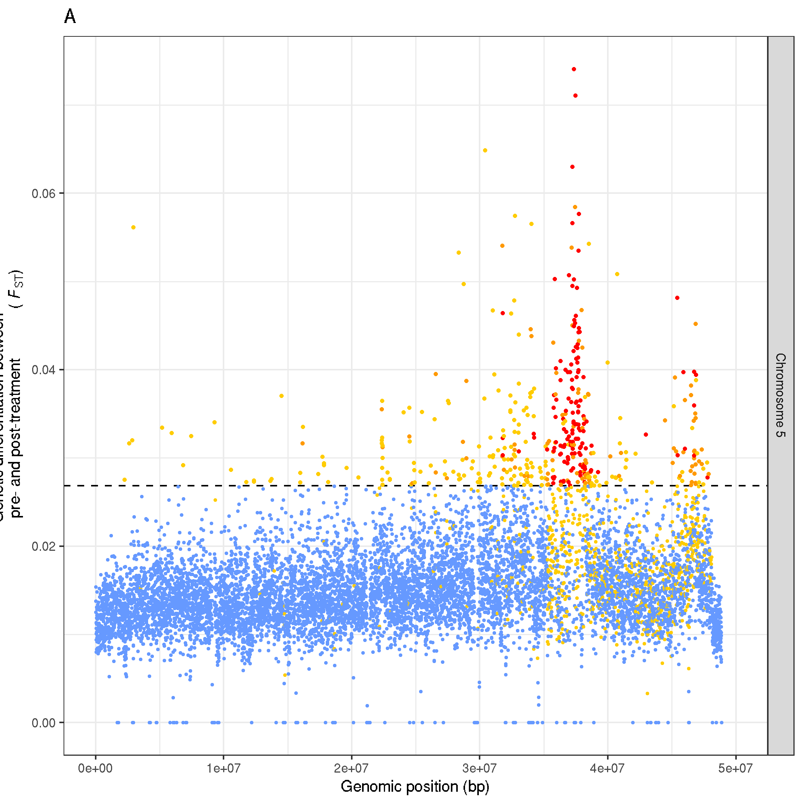
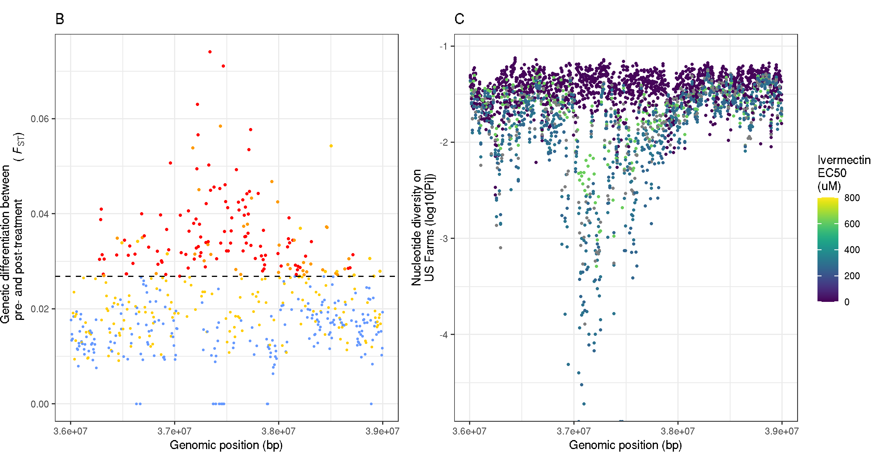
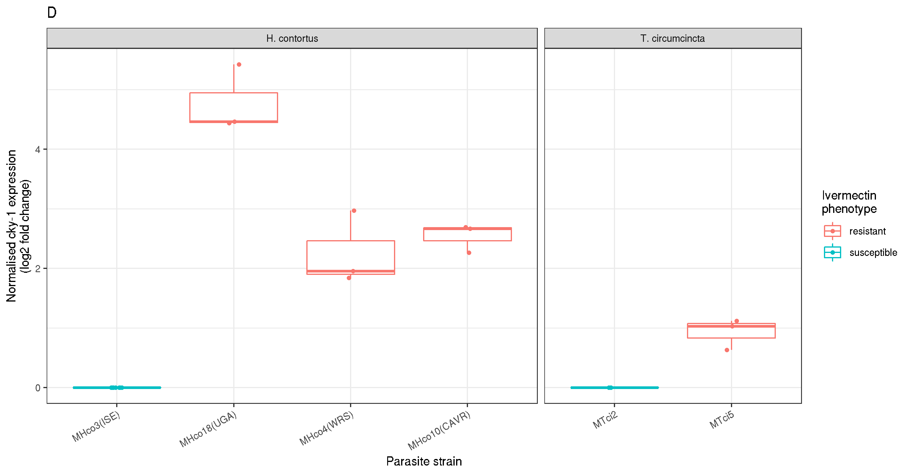
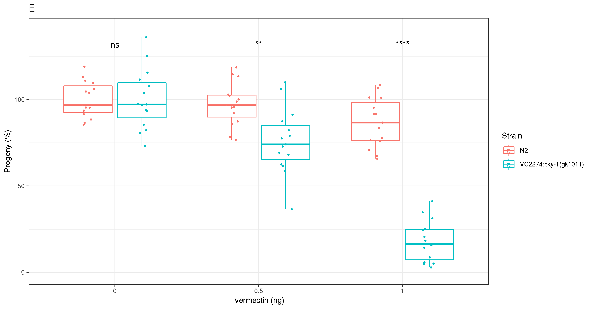
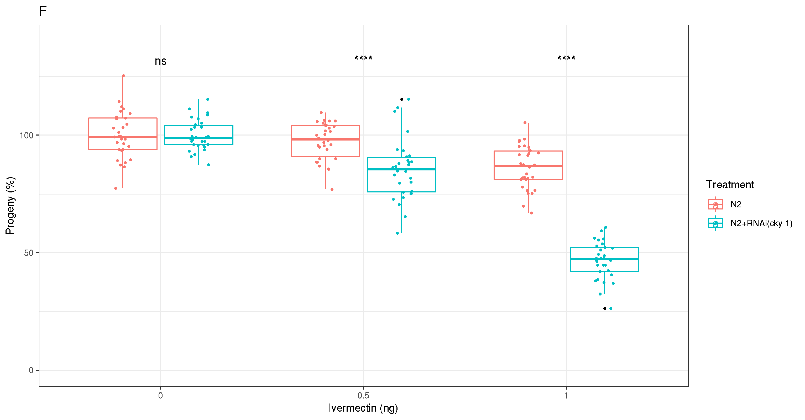
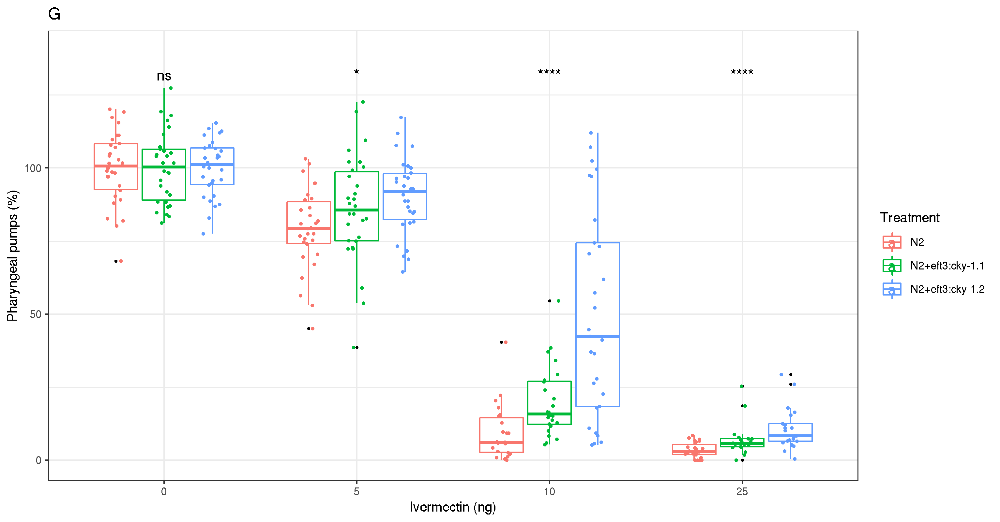

# XQTL: ivermectin analyses


## Download raw data
- to recreate the analyses described below, data can be obtained from my FTP using wget or similar
```
# XQTL ivermectin Fst data
wget ftp://ngs.sanger.ac.uk/production/pathogens/sd21/hcontortus_xqtl/IVM/XQTL_IVM.merged.fst

# Nucleotide diversity data for US farms
wget ftp://ngs.sanger.ac.uk/production/pathogens/sd21/hcontortus_xqtl/IVM/sample*

# RT-qPCR data of cky-1 from H. contortus and T. circumcincta
wget ftp://ngs.sanger.ac.uk/production/pathogens/sd21/hcontortus_xqtl/IVM/RTQs_cky1_v2.txt

# C. elegans development data - balanced deletion
wget ftp://ngs.sanger.ac.uk/production/pathogens/sd21/hcontortus_xqtl/IVM/VC2274_Development_R.txt

# C. elegans development data - RNAi
wget ftp://ngs.sanger.ac.uk/production/pathogens/sd21/hcontortus_xqtl/IVM/RNAi_Development_R.txt

# C. elegans cky-1 transgenic pharyngeal pumping
wget ftp://ngs.sanger.ac.uk/production/pathogens/sd21/hcontortus_xqtl/IVM/Transgenics_Pumping_R.txt


# Advanced intercross Fst data
```


## Genetic differentiation between pre and post treatment on chromosome 5
- focused view of chromosome 5 to show main QTL in XQTL replicates

```shell
# working dir:
cd /nfs/users/nfs_s/sd21/lustre118_link/hc/XQTL/05_ANALYSIS/IVM

ln -s /nfs/users/nfs_s/sd21/lustre118_link/hc/XQTL/04_VARIANTS/XQTL_IVM/XQTL_IVM.merged.fst


```


### R to plot
```R
# load required libraries
library(tidyverse)
library(ggrepel)
library(data.table)
# note - "data.table" has a function called "fread" which is great for quickly loading really large datasets
library(patchwork)
library(viridis)
library(zoo)


# load and reformat the data
xqtl_ivm_fst <- read.table("XQTL_IVM.merged.fst", header = F)
xqtl_ivm_fst <- dplyr::select(xqtl_ivm_fst, V1, V2, V13, V39, V49)
xqtl_ivm_fst <- xqtl_ivm_fst %>% mutate(mean_FST = rowMeans(select(.,V13)))
colnames(xqtl_ivm_fst) <- c("CHR",  "POS",  "FST_R1", "FST_R2", "FST_R3", "FST_MEAN")


# calculate a genome wide significance cutoff
gw_r1 <- mean(xqtl_ivm_fst$FST_R1) + 3*sd(xqtl_ivm_fst$FST_R1)
gw_r2 <- mean(xqtl_ivm_fst$FST_R2) + 3*sd(xqtl_ivm_fst$FST_R2)
gw_r3 <- mean(xqtl_ivm_fst$FST_R3) + 3*sd(xqtl_ivm_fst$FST_R3)
gw_mean <- mean(xqtl_ivm_fst$FST_MEAN) + 3*sd(xqtl_ivm_fst$FST_MEAN)


# extract chromosome 5 data
ivm_chr5_data <-
     xqtl_ivm_fst[xqtl_ivm_fst$CHR == "hcontortus_chr5_Celeg_TT_arrow_pilon", ]

# fix names
ivm_chr5_data <-
     ivm_chr5_data %>%
     mutate(CHR = str_replace_all(CHR, c("hcontortus_chr5_Celeg_TT_arrow_pilon" = "Chromosome 5")))


# set colour for chromosomes
ivm_chr5_data <-
     mutate(ivm_chr5_data,
     point_colour = case_when(
     (FST_R1 < gw_r1 & FST_R2 < gw_r2 & FST_R3 < gw_r3) ~ "#6699FFFF",
     (FST_R1 > gw_r1 & FST_R2 < gw_r2 & FST_R3 < gw_r3) ~ "#FFCC00FF",
     (FST_R1 < gw_r1 & FST_R2 > gw_r2 & FST_R3 < gw_r3) ~ "#FFCC00FF",
     (FST_R1 < gw_r1 & FST_R2 < gw_r2 & FST_R3 > gw_r3) ~ "#FFCC00FF",
     (FST_R1 > gw_r1 & FST_R2 > gw_r2 & FST_R3 < gw_r3) ~ "#FF9900FF",
     (FST_R1 > gw_r1 & FST_R2 < gw_r2 & FST_R3 > gw_r3) ~ "#FF9900FF",
     (FST_R1 > gw_r1 & FST_R2 > gw_r2 & FST_R3 > gw_r3) ~ "#FF0000FF",))

# make the plot
plot_chr5 <-
     ggplot(ivm_chr5_data, aes(POS, FST_MEAN, colour=point_colour, size=ifelse(FST_MEAN>gw_mean,0.6,0.3))) +
     geom_hline(yintercept = gw_mean, linetype = "dashed", col = "black") +
     geom_point() + facet_grid(CHR~.) + scale_color_identity() + scale_size_identity() +
     xlim(0, 50e6) +
     theme_bw() + theme(legend.position = "none", text = element_text(size = 10)) +
     labs(title = "A", x = "Genomic position (bp)", y = expression(paste("Genetic differentiation between\n pre- and post-treatment", " (",~italic(F)[ST],")"))) +
     facet_grid(CHR ~ .)

#plot_chr5
ggsave("XQTL_IVM_chromosome5_replicates.png")

```



## Chromosome 5 QTL

Aim is to show zoomed in region around chromosome 5 main peak, highlighting farm data, genes present, whether genes are differentially expressed


### R to plot
```R

# load data

# load the output of NPstats, and add the drenchrite EC50 per farm
us_farm1 <-read.table("sample_1.pileup.stats",header=T,sep="\t")
us_farm1$sample <- "us_farm1"
us_farm1$ivm_EC50 <- "1.51"
us_farm2 <-read.table("sample_2.pileup.stats",header=T,sep="\t")
us_farm2$sample <- "us_farm2"
us_farm2$ivm_EC50 <- "12.04"
us_farm3 <-read.table("sample_3.pileup.stats",header=T,sep="\t")
us_farm3$sample <- "us_farm3"
us_farm3$ivm_EC50 <- "9.15"
us_farm4 <-read.table("sample_4.pileup.stats",header=T,sep="\t")
us_farm4$sample <- "us_farm4"
us_farm4$ivm_EC50 <- "11.27"
us_farm5 <-d.table("sample_5.pileup.stats",header=T,sep="\t")
us_farm5$sample <- "us_farm5"
us_farm5$ivm_EC50 <- "297.9"
us_farm6 <-read.table("sample_6.pileup.stats",header=T,sep="\t")
us_farm6$sample <- "us_farm6"
us_farm6$ivm_EC50 <- "619"
us_farm7 <-read.table("sample_7.pileup.stats",header=T,sep="\t")
us_farm7$sample <- "us_farm7"
us_farm7$ivm_EC50 <- "312.1"
us_farm8 <-read.table("sample_8.pileup.stats",header=T,sep="\t")
us_farm8$sample <- "us_farm8"
us_farm8$ivm_EC50 <- "NA"
us_farm9 <-read.table("sample_9.pileup.stats",header=T,sep="\t")
us_farm9$sample <- "us_farm9"
us_farm9$ivm_EC50 <- "0.977"
us_farm10 <-read.table("sample_10.pileup.stats",header=T,sep="\t")
us_farm10$sample <- "us_farm10"
us_farm10$ivm_EC50 <- "259.4"


us_farm_data <-  dplyr::bind_rows(us_farm1, us_farm2, us_farm3, us_farm4, us_farm5, us_farm6, us_farm7, us_farm8, us_farm9, us_farm10)

us_farm_data_chr5 <- us_farm_data[us_farm_data$chr == "hcontortus_chr5_Celeg_TT_arrow_pilon", ]
us_farm_data_chr5 <- us_farm_data_chr5 %>%
 mutate(chr = str_replace_all(chr, c("hcontortus_chr5_Celeg_TT_arrow_pilon" = "Chromosome 5")))


plot_fst <-
     ggplot(ivm_chr5_data, aes(POS, FST_MEAN, colour=point_colour, size=ifelse(FST_MEAN>gw_mean,0.6,0.3))) +
     geom_point() +
     scale_color_identity() +
     scale_size_identity() +
     geom_hline(yintercept = gw_mean, linetype = "dashed", col = "black")+
     xlim(36e6,39e6)+
     labs(title = "B", x="Genomic position (bp)", y = expression(paste("Genetic differentiation between\n pre- and post-treatment", " (",~italic(F)[ST],")"))) +
     theme_bw() + theme(text = element_text(size = 10))

plot_pi <-
     ggplot(us_farm_data_chr5, aes((window*10000)-5000,log10(Pi), colour=as.numeric(ivm_EC50))) +
     geom_point(size=0.5) +
     xlim(36e6,39e6) +
     scale_colour_viridis(direction=1,limits = c(0, 800)) +
     labs(title = "C", x="Genomic position (bp)", y="Nucleotide diversity on\nUS Farms (log10[Pi])", colour="Ivermectin\nEC50\n(uM)")+
     theme_bw() + theme(text = element_text(size = 10))

plot_fst + plot_pi

ggsave("XQTL_IVM_chr5QTL_fst_uspi.png")
```



- analysis of RT-qPCR data comparing cky-1 expression in sensitive and resistant strains of H. contortus and T. circumcincta
```bash

cky_RTqpcr <- read.table("RTQs_cky1_v2.txt", header=T, sep="\t")
cky_RTqpcr <- filter(cky_RTqpcr, Normaliser != "B-tubulin")

plot_RTqpcr <-
     ggplot(cky_RTqpcr, aes(x = factor(Strain, level = c('MHco3(ISE)', 'MHco18(UGA)', 'MHco4(WRS)', 'MHco10(CAVR)', 'MTci2', 'MTci5')), y = LogFoldChange, col=Response)) +
     geom_boxplot(outlier.size=0.5, outlier.color="black") +
     geom_point(position=position_jitterdodge(jitter.width=0.1),size=1) +
     facet_grid(~Species, drop = TRUE,scales = "free", space = "free") +
     theme_bw() + theme(text = element_text(size = 10), axis.text.x = element_text(angle = 30, vjust = 1, hjust=1)) +
     labs(title = "D", x = "Parasite strain", y = "Normalised cky-1 expression\n(log2 fold change)", col="Ivermectin\nphenotype")

plot_RTqpcr

ggsave("XQTL_IVM_cky-1_RTqPCR.png")


```



## C elegans validation of cky-1
### Development assay - Balanced knockout of cky-1
```R
library(tidyverse)
library(ggpubr)

cky_ko <- read.table("VC2274_Development_R.txt", header=T)

cky_ko_merge <- cky_ko %>% mutate_if(is.character, str_replace_all, pattern = '.R[123]', replacement = '')
cky_ko_merge <- cky_ko_merge %>% mutate_if(is.character, str_replace_all, pattern = 'VC2274', replacement = 'VC2274:cky-1(gk1011)')


plot_ko <-
     ggplot(cky_ko_merge, aes(as.factor(Ivermectin),Normalised*100, col=Group)) +
     geom_boxplot(outlier.size=0.5, outlier.color="black") +
     ylim(0,140) +
     geom_point(position=position_jitterdodge(jitter.width=0.1),aes(group=Group,col=Group),size=0.5) +
     theme_bw() + theme(text = element_text(size = 10)) +
     labs(title= "E", x="Ivermectin (ng)", y="Progeny (%)", col="Strain") +
     stat_compare_means(aes(group = Group), label = "p.signif", label.y = 130, method = "kruskal.test")

plot_ko
ggsave("XQTL_IVM_cky-1_KO.png")
```


### Development assay - RNAi of cky-1
```R
cky_rnai <- read.table("RNAi_Development_R.txt", header=T)

cky_rnai_merge <- cky_rnai %>% mutate_if(is.character, str_replace_all, pattern = '_[123]', replacement = '')
cky_rnai_merge <- cky_rnai_merge %>% mutate_if(is.character, str_replace_all, pattern = 'Control', replacement = 'N2')
cky_rnai_merge <- cky_rnai_merge %>% mutate_if(is.character, str_replace_all, pattern = 'RNAi', replacement = 'N2+RNAi(cky-1)')

 plot_rnai <-
     ggplot(cky_rnai_merge, aes(as.factor(Ivermectin),Normalised*100, col=Group)) +
     geom_boxplot(outlier.size=0.5, outlier.color="black") +
     ylim(0,140) +
     geom_point(position=position_jitterdodge(jitter.width=0.1),aes(group=Group,col=Group),size=0.5) +
     theme_bw() + theme(text = element_text(size = 10)) +
     labs(title= "F", x="Ivermectin (ng)", y="Progeny (%)", col="Treatment") +
     stat_compare_means(aes(group = Group), label = "p.signif", label.y = 130, method = "kruskal.test")

plot_rnai
ggsave("XQTL_IVM_cky-1_rnai.png")
```



```R
cky_trans <- read.table("Transgenics_Pumping_R.txt", header=T)
cky_trans_merge <- cky_trans %>% mutate_if(is.character, str_replace_all, pattern = '.R[123]', replacement = '')
cky_trans_merge <- cky_trans_merge %>% mutate_if(is.character, str_replace_all, pattern = 'CeEFT3_L1', replacement = 'N2+eft3:cky-1.1')
cky_trans_merge <- cky_trans_merge %>% mutate_if(is.character, str_replace_all, pattern = 'CeEFT3_L2', replacement = 'N2+eft3:cky-1.2')
cky_trans_merge <- filter(cky_trans_merge, Ivermectin != "50")


plot_trans <-
     ggplot(cky_trans_merge, aes(as.factor(Ivermectin),Normalised*100, col=Group)) +
     geom_boxplot(outlier.size=0.25, outlier.color="black") +
     ylim(0,140) +
     geom_point(position=position_jitterdodge(jitter.width=0.1),aes(group=Group,col=Group),size=0.5)+
     theme_bw() + theme(text = element_text(size = 10)) +
     labs(title= "G", x="Ivermectin (ng)", y="Pharyngeal pumps (%)", col="Treatment") +
     stat_compare_means(aes(group = Group), label = "p.signif", label.y = 130, method = "kruskal.test")

plot_trans

ggsave("XQTL_IVM_cky-1_trans.png")
```



- make the multipanel plot
```bash
# using patchwork
plot_chr5 / ((plot_fst / plot_pi / plot_RTqpcr) |  (plot_ko / plot_rnai / plot_trans)) +
     plot_layout(ncol=1, heights = c(2, 6))

# save
ggsave("XQTL_Figure_5.pdf", useDingbats = FALSE, width = 250, height = 260, units = "mm")
ggsave("XQTL_Figure_5.png")
```


```R
# testing our some different plot designs for the RT-qPCR data
plot_1 <- ggplot(cky_RTqpcr, aes(x = factor(Strain, level = c('MHco3(ISE)', 'MHco18(UGA)', 'MHco4(WRS)', 'MHco10(CAVR)', 'MTci2', 'MTci5')), y = LogFoldChange, col=Response)) +
          geom_point(position=position_jitterdodge(jitter.width=0.1),size=1) +
          facet_grid(~Species, drop = TRUE,scales = "free", space = "free") +
          theme_bw() + theme(text = element_text(size = 10)) +
          labs(x = "Parasite strain", y = "Normalised cky-1 expression\n(log2 fold change)", col="Ivermectin\nphenotype") +
          theme(axis.text.x = element_text(angle = 30, vjust = 1, hjust=1))

plot_2 <- ggplot(cky_RTqpcr, aes(x = factor(Strain, level = c('MHco3(ISE)', 'MHco18(UGA)', 'MHco4(WRS)', 'MHco10(CAVR)', 'MTci2', 'MTci5')), y = LogFoldChange, col=Response)) +
          geom_boxplot(outlier.size=0.5, outlier.color="black") +
          geom_point(position=position_jitterdodge(jitter.width=0.1),size=1) +
          facet_grid(~Species, drop = TRUE,scales = "free", space = "free") +
          theme_bw() + theme(text = element_text(size = 10)) +
          labs(x = "Parasite strain", y = "Normalised cky-1 expression\n(log2 fold change)", col="Ivermectin\nphenotype") +
          theme(axis.text.x = element_text(angle = 30, vjust = 1, hjust=1))

plot_3 <-  ggplot(cky_RTqpcr, aes(x = factor(Strain, level = c('MHco3(ISE)', 'MHco18(UGA)', 'MHco4(WRS)', 'MHco10(CAVR)', 'MTci2', 'MTci5')), y = LogFoldChange)) +
          geom_bar(aes(fill=Response),position = "dodge", stat = "summary", fun.y = "mean") +
          facet_grid(~Species, drop = TRUE,scales = "free", space = "free") +
          theme_bw() + theme(text = element_text(size = 10)) +
          labs(x = "Parasite strain", y = "Normalised cky-1 expression\n(log2 fold change)", col="Ivermectin\nphenotype") +
          theme(axis.text.x = element_text(angle = 30, vjust = 1, hjust=1))

plot_a + plot_b + plot_c
```


## Advanced intercross analysis
```bash
#-----
library(ggplot2)
library(patchwork)

data <- read.table("/nfs/users/nfs_s/sd21/lustre118_link/hc/XQTL/04_VARIANTS/ADVANCED_INTERCROSS/XQTL_ADVANCED_INTERCROSS.merged.fst",header=F)
data <- data[data$V1!="hcontortus_chr_mtDNA_arrow_pilon",]

# chromosome colours
chr_colours <- c("blue", "cornflowerblue", "blue", "cornflowerblue", "blue", "cornflowerblue")


#						Rep1	Rep2	Rep3
#control - pre v 0.5X	V17		V51		V83
#control - pre v 2X		V11		V135	V161

#IVM pre v 0.5x			V251	V267	V281
#IVM pre v 2x			V287	V297	V305


#rep1
# control_0.5x.1 <- ggplot(data)+
#      geom_point(aes(1:nrow(data)*5000, V17,  colour = V1),size=0.05)+
#      ylim(0,0.1) +
#      labs(x = "Chromosomal position (bp)",  y = "Genetic differentiation between \npre- and post-treatment (Fst)") +
#      scale_color_manual(values = chr_colours) +
#      scale_x_continuous(breaks = seq(0,  3e8,  0.5e8), limits = c(0,  300e6)) +
#      theme_bw()+
#      theme(legend.position = "none", text = element_text(size = 8))
#
# control_2X.1 <- ggplot(data)+geom_point(aes(1:nrow(data)*5000,V11,colour = V1),size=0.05)+
#   ylim(0,0.1)+
#   labs(x = "Chromosomal position (bp)",  y = "Genetic differentiation between \npre- and post-treatment (Fst)") +
#   scale_color_manual(values = chr_colours) +
#   scale_x_continuous(breaks = seq(0,  3e8,  0.5e8), limits = c(0,  300e6)) +
#   theme_bw()+
#   theme(legend.position = "none", text = element_text(size = 8))
#
# ivm_0.5X.1 <- ggplot(data)+geom_point(aes(1:nrow(data)*5000,V251,colour = V1),size=0.05)+
#   ylim(0,0.1)+
#   labs(x = "Chromosomal position (bp)",  y = "Genetic differentiation between \npre- and post-treatment (Fst)") +
#   scale_color_manual(values = chr_colours) +
#   scale_x_continuous(breaks = seq(0,  3e8,  0.5e8), limits = c(0,  300e6)) +
#   theme_bw()+
#   theme(legend.position = "none", text = element_text(size = 8))

ivm_2X.1 <- ggplot(data) +
     geom_rect(xmin= 44449*5000 , xmax= 44508*5000, ymin= 0 , ymax= 1, colour = "red") + geom_point(aes(1:nrow(data)*5000,V287,colour = V1),size=0.05)+
     ylim(0,0.1)+
     labs(title = "F", x = "Chromosomal position (bp)",  y = "Genetic differentiation between \npre- and post-treatment (Fst)") +
     scale_color_manual(values = chr_colours) +
     scale_x_continuous(breaks = seq(0,  3e8,  0.5e8), limits = c(0,  300e6)) +
     theme_bw()+
     theme(legend.position = "none", text = element_text(size = 8))

#control_0.5x.1 + ivm_0.5X.1 + control_2X.1 + ivm_2X.1 + plot_layout(ncol=2)


#rep2
control_0.5x.2 <- ggplot(data)+
     geom_rect(xmin= 44449*5000 , xmax= 44508*5000, ymin= 0 , ymax= 1, colour = "red") + geom_point(aes(1:nrow(data)*5000,V51,colour = V1),size=0.05)+
     ylim(0,0.1)+
     labs(title = "A", x = "Chromosomal position (bp)",  y = "Genetic differentiation between \npre- and post-treatment (Fst)") +
     scale_color_manual(values = chr_colours) +
     scale_x_continuous(breaks = seq(0,  3e8,  0.5e8), limits = c(0,  300e6)) +
     theme_bw()+
     theme(legend.position = "none", text = element_text(size = 8))

control_2X.2 <- ggplot(data) +
     geom_rect(xmin= 44449*5000 , xmax= 44508*5000, ymin= 0 , ymax= 1, colour = "red")+ geom_point(aes(1:nrow(data)*5000,V135,colour = V1),size=0.05)+
     ylim(0,0.1)+
     labs(title = "B", x = "Chromosomal position (bp)",  y = "Genetic differentiation between \npre- and post-treatment (Fst)") +
     scale_color_manual(values = chr_colours) +
     scale_x_continuous(breaks = seq(0,  3e8,  0.5e8), limits = c(0,  300e6)) +
     theme_bw()+
     theme(legend.position = "none", text = element_text(size = 8))

ivm_0.5X.2 <- ggplot(data) +
     geom_rect(xmin= 44449*5000 , xmax= 44508*5000, ymin= 0 , ymax= 1, colour = "red") + geom_point(aes(1:nrow(data)*5000,V267,colour = V1),size=0.05)+
     ylim(0,0.1)+
     labs(title = "C", x = "Chromosomal position (bp)",  y = "Genetic differentiation between \npre- and post-treatment (Fst)") +
     scale_color_manual(values = chr_colours) +
     scale_x_continuous(breaks = seq(0,  3e8,  0.5e8), limits = c(0,  300e6)) +
     theme_bw()+
     theme(legend.position = "none", text = element_text(size = 8))

ivm_2X.2 <- ggplot(data) +
     geom_rect(xmin= 44449*5000 , xmax= 44508*5000, ymin= 0 , ymax= 1, colour = "red") +
     geom_point(aes(1:nrow(data)*5000,V297,colour = V1),size=0.05)+
     ylim(0,0.1)+
     labs(title = "D", x = "Chromosomal position (bp)",  y = "Genetic differentiation between \npre- and post-treatment (Fst)") +
     scale_color_manual(values = chr_colours) +
     scale_x_continuous(breaks = seq(0,  3e8,  0.5e8), limits = c(0,  300e6)) +
     theme_bw()+
     theme(legend.position = "none", text = element_text(size = 8))

 ivm_2X.22 <- ggplot(data) +
      geom_rect(xmin= 44449*5000 , xmax= 44508*5000, ymin= 0 , ymax= 1, colour = "red") +
      geom_point(aes(1:nrow(data)*5000,V297,colour = V1),size=0.05)+
      ylim(0,0.1)+
      labs(title = "E", x = "Chromosomal position (bp)",  y = "Genetic differentiation between \npre- and post-treatment (Fst)") +
      scale_color_manual(values = chr_colours) +
      scale_x_continuous(breaks = seq(0,  3e8,  0.5e8), limits = c(0,  300e6)) +
      theme_bw()+
      theme(legend.position = "none", text = element_text(size = 8))


#control_0.5x.2 + ivm_0.5X.2 + control_2X.2 + ivm_2X.2 + plot_layout(ncol=2)


#rep3
# control_0.5x.3 <- ggplot(data)+geom_point(aes(1:nrow(data)*5000,V83,colour = V1),size=0.1)+
#   ylim(0,0.1)+
#   labs(x = "Chromosomal position (bp)",  y = "Genetic differentiation between \npre- and post-treatment (Fst)") +
#   scale_color_manual(values = chr_colours) +
#   scale_x_continuous(breaks = seq(0,  3e8,  0.5e8), limits = c(0,  300e6)) +
#   theme_bw()+
#   theme(legend.position = "none", text = element_text(size = 10))
#
# control_2X.3 <- ggplot(data)+geom_point(aes(1:nrow(data)*5000,V161,colour = V1),size=0.1)+
#   ylim(0,0.1)+
#   labs(x = "Chromosomal position (bp)",  y = "Genetic differentiation between \npre- and post-treatment (Fst)") +
#   scale_color_manual(values = chr_colours) +
#   scale_x_continuous(breaks = seq(0,  3e8,  0.5e8), limits = c(0,  300e6)) +
#   theme_bw()+
#   theme(legend.position = "none", text = element_text(size = 10))
#
# ivm_0.5X.3 <- ggplot(data)+geom_point(aes(1:nrow(data)*5000,V281,colour = V1),size=0.1)+
#   ylim(0,0.1)+
#   labs(x = "Chromosomal position (bp)",  y = "Genetic differentiation between \npre- and post-treatment (Fst)") +
#   scale_color_manual(values = chr_colours) +
#   scale_x_continuous(breaks = seq(0,  3e8,  0.5e8), limits = c(0,  300e6)) +
#   theme_bw()+
#  theme(legend.position = "none", text = element_text(size = 10))

ivm_2X.3 <- ggplot(data) +
     geom_rect(xmin= 44449*5000 , xmax= 44508*5000, ymin= 0 , ymax= 1, colour = "red") +
     geom_point(aes(1:nrow(data)*5000,V305,colour = V1),size=0.05)+
     ylim(0,0.1)+
     labs(title = "G", x = "Chromosomal position (bp)",  y = "Genetic differentiation between \npre- and post-treatment (Fst)") +
     scale_color_manual(values = chr_colours) +
     scale_x_continuous(breaks = seq(0,  3e8,  0.5e8), limits = c(0,  300e6)) +
     theme_bw()+
     theme(legend.position = "none", text = element_text(size = 8))

#control_0.5x.3 + ivm_0.5X.3 + control_2X.3 + ivm_2X.3 + plot_layout(ncol=2)


# summary of XQTL and AI endpoints
(control_0.5x.2 | ivm_0.5X.2 ) / (
control_2X.2 | ivm_2X.2) / ivm_2X.22 + ivm_2X.1 + ivm_2X.3 + plot_layout(ncol=1)

ggsave("XQTL_advanced_intercross_panel.pdf", useDingbats = FALSE, width = 170, height = 250, units = "mm")
ggsave("XQTL_advanced_intercross_panel.png")

```


#-----------------------------------------------------------------------------------------

## Evidence of selection on beta-tubulin by ivermectin
- this has been proposed in a couple of different papers - that ivermectin treatment selects for beta-tubulin variation - however, it doesnt see to hold up.
- Therefore, aim is to show frequency of Phe167Tyr Phe200Tyr variants pre/post IVM treatment in genetic cross, and then against EC50 for ivermectin in US farms


- Prepare the data
```shell
#working dir:
cd /nfs/users/nfs_s/sd21/lustre118_link/hc/XQTL/04_VARIANTS/XQTL_IVM


grep "pre" bam.list  > ivm_pretreatment_samples.list
grep "post" bam.list  > ivm_posttreatment_samples.list

cp ../XQTL_BZ/btub.positions .

# extract allele count data for for beta tubulin variants in ivermectin XQTL experiment
vcftools --vcf XQTL_IVM.raw.snpeff.vcf --keep ivm_pretreatment_samples.list --positions btub.positions --extract-FORMAT-info AD --out ivm_btub_pretreatment
vcftools --vcf XQTL_IVM.raw.snpeff.vcf --keep ivm_posttreatment_samples.list --positions btub.positions --extract-FORMAT-info AD --out ivm_btub_posttreatment

# convert allele count data to variant frequency
for i in `ls ivm*AD.FORMAT`; do
      grep "^hcon" ${i} | awk -F '[\t,]' '{print $1,$2,$4/($3+$4),$6/($5+$6),$8/($7+$8),$10/($9+$10)}' OFS="\t" > ${i%.AD.FORMAT}.ADfreq;
done
```

- need to extract the beta-tubulin variant positions from US field data
```shell
#working dir:
cd /nfs/users/nfs_s/sd21/lustre118_link/hc/XQTL/04_VARIANTS/US_FIELD/VCF

cp ../../XQTL_BZ/btub.positions btub1.positions

cat bam.list > samples.list

vcftools --vcf 1.hcontortus_chr1_Celeg_TT_arrow_pilon.snpeff.vcf --keep samples.list --positions btub1.positions --extract-FORMAT-info AD --out us_farms_btub1

# wrangle the data to generate allele frequencies for each variant positon
grep "^hcon" us_farms_btub1.AD.FORMAT | awk -F '[\t,]' '{print $1,$2,$4/($3+$4),$6/($5+$6),$8/($7+$8),$10/($9+$10),$12/($11+$12),$14/($13+$14),$16/($15+$16),$18/($17+$18),$20/($19+$20),$22/($21+$22)}' OFS="\t" > us_farms_btub1.ADfreq
```


- R to plot
```R
# load required libraries
library(reshape2)
library(ggplot2)
library(dplyr)
library(stringr)
library(tidyr)
library(rstatix)

# reform the data
pre <- read.table("ivm_btub_pretreatment.ADfreq")
colnames(pre) <- c("CHR", "POS", "R1", "R1.2", "R2", "R3")
pre <- melt(pre, id = c("CHR", "POS"), variable.name = "SAMPLE_ID")

post <- read.table("ivm_btub_posttreatment.ADfreq")
colnames(post) <- c("CHR", "POS", "R1", "R1.2", "R2", "R3")
post <- melt(post, id = c("CHR", "POS"), variable.name = "SAMPLE_ID")

data <- dplyr::full_join(pre, post, by = c("CHR", "POS", "SAMPLE_ID"))
data$TREATMENT <- "Ivermectin"
colnames(data) <- c("CHR", "POS", "SAMPLE_ID", "PRE_TREATMENT", "POST_TREATMENT", "TREATMENT")

# change the labels
data <- data %>%
  mutate(POS = str_replace(POS, c("7029569", "7029790"), c("Phe167Tyr", "Phe200Tyr")))


# make the plot
plot_a <- ggplot(data) +
     geom_segment(aes(x = "1.PRE", xend = "2.POST", y = PRE_TREATMENT, yend = POST_TREATMENT, col = factor(SAMPLE_ID), group = POS), size = 1) +
     labs(title = "A", x = "Sampling time-point", y = "Resistant allele frequency", col = "Replicate") +
     ylim(-0.05, 1.05) +
     facet_grid(TREATMENT ~ POS) +
     theme_bw() + theme(text = element_text(size = 10))


# perform pairwise t tests between pre/post for each SNP on BZ treated samples
data_stats <- data %>%
  gather(key = "TREATMENT", value = "FREQ", PRE_TREATMENT, POST_TREATMENT)

stat.test <- data_stats %>%
    group_by(POS) %>%
    pairwise_t_test(
      FREQ ~ TREATMENT, paired = TRUE,
      p.adjust.method = "bonferroni"
      ) %>%
    select(-df, -statistic, -p) # Remove details

stat.test$TREATMENT <- "Ivermectin"

p.data <- stat.test


# make new plot with p values annotated on it
plot_a <- plot_a +
     geom_text(data = p.data, aes(x = 1.5, y = 0.95, group = POS, label = paste('P = ',p.adj)), size = 3)

plot_a


# reformat the data
us_btub1 <- read.table("us_farms_btub1.ADfreq")
colnames(us_btub1) <- c("CHR", "POS", "Farm 1", "Farm 2", "Farm 3", "Farm 4", "Farm 5", "Farm 6", "Farm 7", "Farm 8", "Farm 9", "Farm 10")

us_btub1 <- melt(us_btub1,  id = c("CHR",  "POS"),  variable.name = "SAMPLE_ID")

# manually input the EC50 data from Table SX
ivm_conc <- c(1.51, 1.51, 12.04, 12.04, 9.15, 9.15, 11.27, 11.27, 297.9, 297.9, 619, 619, 312.1, 312.1, NA, NA, 0.977, 0.977, 259.4, 259.4)

us_btub1$IVM_CONCENTRATION <- ivm_conc
colnames(us_btub1) <- c("CHR", "POS", "SAMPLE_ID", "ALLELE_FREQ", "IVM_CONCENTRATION")

us_btub1 <- us_btub1 %>%
  mutate(POS = str_replace(POS,  c("7029569", "7029790"),  c("Phe167Tyr", "Phe200Tyr")))

# calculate correlation coefficient between alllele frequency and concentration
af_ivm_cor <- cor.test(us_btub1$ALLELE_FREQ,  us_btub1$IVM_CONCENTRATION,  method = "pearson",  use = "complete.obs")

P167 <- us_btub1[us_btub1$POS != "Phe167Tyr", ]
P200 <- us_btub1[us_btub1$POS != "Phe200Tyr", ]

P167cor <- cor.test(P167$ALLELE_FREQ,  P167$IVM_CONCENTRATION,  method = "pearson",  use = "complete.obs")
P200cor <- cor.test(P200$ALLELE_FREQ,  P200$IVM_CONCENTRATION,  method = "pearson",  use = "complete.obs")

P167cor.data <- as.data.frame(P167cor$estimate)
P167cor.data$pvalue <- P167cor$p.value
colnames(P167cor.data) <- c("COR", "PVALUE")

P200cor.data <- as.data.frame(P200cor$estimate)
P200cor.data$pvalue <- P200cor$p.value
colnames(P200cor.data) <- c("COR", "PVALUE")

cor.data <- dplyr::bind_rows(P167cor.data,  P200cor.data)
cor.data$CHR <- "hcontortus_chr1_Celeg_TT_arrow_pilon"
cor.data$POS <-  c("Phe167Tyr", "Phe200Tyr")

colnames(cor.data) <- c("COR", "PVALUE", "CHR", "POS")


# make the plot
plot_b <- ggplot(us_btub1) +
     geom_smooth(aes(IVM_CONCENTRATION, ALLELE_FREQ), method = 'lm', col = 'grey', se = FALSE) +
     geom_jitter(aes(IVM_CONCENTRATION, ALLELE_FREQ, col = SAMPLE_ID), size = 2) +
     geom_text_repel(aes(IVM_CONCENTRATION, ALLELE_FREQ, label = SAMPLE_ID, col = SAMPLE_ID), size = 2) +
     labs(title = "B", y = "Resistant Allele Frequency", x = "Ivermectin EC50 (nM)", col = "US farm ID") +
     ylim(-0.05, 1.05) +
     facet_grid(. ~ POS) +
     theme_bw() + theme(legend.position = "none", text = element_text(size = 10))

plot_b <- plot_b + geom_text(data = cor.data,  aes(x = 500,  y = 1,  group = POS,  label = paste('r = ', signif(COR, 3), '\n', 'P = ', signif(PVALUE, 3))), size = 3)

# combine panels a and b using patchwork
plot_a + plot_b + plot_layout(ncol = 2)

# save it
ggsave("FigureSX_USfarm_btub1vsIVM.pdf",  useDingbats = FALSE,  width = 170,  height = 100,  units = "mm")
ggsave("FigureSX_USfarm_btub1vsIVM.png")

```


#-------------------------------------------------------------------------------


## 5000 L3 per pool example
- used in Supplementary Figure X
```R
# load libraries
library(ggplot2)
library(patchwork)


# load data
data <- read.table("/nfs/users/nfs_s/sd21/lustre118_link/hc/XQTL/04_VARIANTS/XQTL_L3_5k/XQTL_L3_5k.merged.fst",header=F)
data <- L3_5000[L3_5000$V1!="hcontortus_chr_mtDNA_arrow_pilon",]

# chromosome colours
chr_colours <- c("blue", "cornflowerblue", "blue", "cornflowerblue", "blue", "cornflowerblue")

# plot genome wide diversity
plot_5k_L3 <- ggplot(data)+
     geom_point(aes(1:nrow(data) * 5000, V7, alpha = V4, colour = V1),size = 0.1)+
     ylim(0, 0.1) +
     labs(title = "A", x = "Chromosomal position (bp)",  y = "Genetic differentiation between \npre- and post-treatment (Fst)") +
     scale_color_manual(values = chr_colours) +
     scale_x_continuous(breaks = seq(0,  3e8,  0.5e8), limits = c(0,  300e6)) +
     theme_bw()+ theme(legend.position = "none", text = element_text(size = 10))

# extract chromosome 5 data
data_chr5 <- data[data$V1=="hcontortus_chr5_Celeg_TT_arrow_pilon",]

# plot chromosome 5 with zoom on QTL
plot_5k_L3_chr5 <- ggplot(data_chr5)+
     geom_point(aes(V2,V7),size = 0.5, colour = "cornflowerblue")+
     ylim(0,0.1)+
     labs(title = "B",  x = "Genomic position (bp)",  y = "Genetic differentiation (Fst)") +
     scale_x_continuous() +
     xlim(36.5e6, 38.5e6) +
     theme_bw() + theme(legend.position = "none", text = element_text(size = 10))

# bring plots together
plot_5k_L3 + plot_5k_L3_chr5 + plot_layout(ncol = 1)

# save it.
ggsave("XQTL_SupplementaryFigure_5000L3.pdf", useDingbats = FALSE, width = 170, height = 100, units = "mm")
ggsave("XQTL_SupplementaryFigure_5000L3.png")
```


## Direct vs indirect selection
- presented as Supplementary Figure X
```R
#XQTL F2 adults

library(ggplot2)
library(patchwork)
library(dplyr)

# chromosome colours
chr_colours <- c("blue", "cornflowerblue", "blue", "cornflowerblue", "blue", "cornflowerblue")

# load data1
male_data <- read.table("/nfs/users/nfs_s/sd21/lustre118_link/hc/XQTL/04_VARIANTS/XQTL_ADULT/XQTL_ADULTS.merged.fst",header=F)
male_data <- male_data[male_data$V1!="hcontortus_chr_mtDNA_arrow_pilon",]

plot_male <- ggplot(male_data)+
     geom_point(aes(1:nrow(male_data)*5000, V7, colour = V1), size=0.1)+
     #ylim(0,0.2)+
     labs(title = "A", x = "Chromosomal position (bp)",  y = "Genetic differentiation between \nsurviving adult males and untreated L3 (Fst)") +
     scale_color_manual(values = chr_colours) +
     scale_x_continuous(breaks = seq(0,  3e8,  0.5e8), limits = c(0,  300e6)) +
     theme_bw()+
     theme(legend.position = "none", text = element_text(size = 8))


chr5_maledata <- filter(male_data,male_data$V1=="hcontortus_chr5_Celeg_TT_arrow_pilon")
plot_male_chr5 <- ggplot(chr5_maledata)+
     geom_point(aes(V2, V7, colour = V1), size=1)+
     #ylim(0,0.2)+
     xlim(36.5e6,38.5e6)+
     labs(title = "B", x = "Chromosomal position (bp)",  y = "Genetic differentiation between \nsurviving adult males and untreated L3 (Fst)") +
     scale_color_manual(values = chr_colours) +
     theme_bw()+
     theme(legend.position = "none", text = element_text(size = 8))

# dose response curve
dose_response_data <- read.table("/nfs/users/nfs_s/sd21/lustre118_link/hc/XQTL/05_ANALYSIS/IVM/DrenchRiteF5_IVM_pooled.txt", header=T)
ivm_dose_response_data <- dplyr::filter(dose_response_data,dose_response_data$Treatment=="IVM_aglycone" & dose_response_data$Total>0)


#probit model
#logr_probit <- glm(IVM_logged ~ (X._developed_to_L3/100), data=ivm_dose_response_data, family=binomial(link="probit"))
#preddat <- data.frame(IVM_logged = seq(0, 3.5, .01) )
#preddat$pred <- predict(logr_probit, newdata = preddat, type = "response")

plot_DR_curve <- ggplot(ivm_dose_response_data,aes(IVM_logged,X._developed_to_L3/100)) +
     geom_point(aes(color=as.factor(Plate)))+
     #geom_line(data = preddat, aes(y = pred), color = "red")+
     geom_smooth(method="glm",method.args = list(family = quasibinomial(link = "probit")),colour="blue")+
     labs(title = "C", y = "Proportion developing to L3", x = "Ivermectin concentration [log10(nM)]", colour = "Replicate") +
     theme_bw()+
     theme(text = element_text(size = 8))


# genome wide dose response

dose_data <- read.table("/nfs/users/nfs_s/sd21/lustre118_link/hc/XQTL/04_VARIANTS/DOSE_RESPONSE/DOSE_RESPONSE.merged.fst",header=F)
dose_data <- dose_data[dose_data$V1!="hcontortus_chr_mtDNA_arrow_pilon",]

plot_DR_gw <- ggplot(dose_data)+
     geom_point(aes(1:nrow(dose_data)*5000, V7, colour = V1), size=0.1)+
     #ylim(0,0.2)+
     labs(title = "D", x = "Chromosomal position (bp)",  y = "Genetic differentiation between \n<EC25 and >EC75 L3 pools (Fst)") +
     scale_color_manual(values = chr_colours) +
     scale_x_continuous(breaks = seq(0,  3e8,  0.5e8), limits = c(0,  300e6)) +
     theme_bw()+
     theme(legend.position = "none", text = element_text(size = 8))


     # chr5_dose_data <- filter(dose_data,dose_data$V1=="hcontortus_chr5_Celeg_TT_arrow_pilon")
     # ggplot(chr5_dose_data)+
     #      geom_point(aes(V2, V7, colour = V1), size=1)+
     #      #ylim(0,0.2)+
     #      xlim(36.5e6,38.5e6)+
     #      labs(title = "B", x = "Chromosomal position (bp)",  y = "Genetic differentiation between \npre- and post-treatment (Fst)") +
     #      scale_color_manual(values = chr_colours) +
     #      theme_bw()+
     #      theme(legend.position = "none", text = element_text(size = 8))


plot_male + (plot_male_chr5 | plot_DR_curve) + plot_DR_gw + plot_layout(ncol=1)

ggsave("XQTL_SupplementaryFigureX_male_doseresponse.pdf", useDingbats = FALSE, width = 170, height = 200, units = "mm")
ggsave("XQTL_SupplementaryFigureX_male_doseresponse.png")
```


## Other

- originally planned to show RNA-seq data highlighting DE of genes in the chromosome 5 peak and that cky-1 was the most obviously differentially over expressed, however, we decided in the end to no do this and keep the RNa-seq data in the RNA-seq paper
- here is the code we didtn end up using, saved for future reference

```bash
# pulling gene coordinates out of the annotation. Note, most of the command is to remove irrelevant information, easily done with "sed"
grep "gene" ANNOTATION.gff | sed -e 's/owner=irisadmin@local.host;//g' -e 's/date_last_modified=[0-9][0-9][0-9][0-9]-[0-9][0-9]-[0-9][0-9];//g' | awk -F '[\t=;]' '{print $12,$1,$4,$5,$7}' OFS="\t" > genes.positions
```
- make some plots of the RNA-seq data, with subsets of genes that are DE labelled
```R
genes <- read.table("genes.positions",header=F)
colnames(genes) <- c("name_PUGAxPISE","chr","start","end","dir")

rnaseq <- read.table("summary_DESEQ_WBPS15gff_alpha0.01_males_all3IVMcomps.tabular", header=T)

rnaseq_data <- dplyr::full_join(genes,rnaseq,by="name_PUGAxPISE")

rnaseq_data_chr5 <- rnaseq_data[rnaseq_data$chr == "hcontortus_chr5_Celeg_TT_arrow_pilon", ]
rnaseq_data_chr5 <- rnaseq_data_chr5 %>%
 mutate(chr = str_replace_all(chr, c("hcontortus_chr5_Celeg_TT_arrow_pilon" = "Chromosome 5")))


# parental ISE vs parent UGA
rnaseq_plot1 <- ggplot(rnaseq_data_chr5) +
       geom_point(aes(start,log2FoldChange),size=0.5,col="lightgrey")+
       geom_point(aes(start,log2FoldChange, col=-log10(padj), size=-log10(padj)))+
       geom_text_repel(data=subset(rnaseq_data_chr5,log2FoldChange > 2 | log2FoldChange < -2),aes(start,log2FoldChange, label=name_PUGAxPISE)) +
       scale_colour_viridis(direction=-1, limits = c(0, 30))+
       scale_size_continuous(limits = c(0, 30)) +
       theme_bw()+
       xlim(36e6,39e6)+
       labs(title="parental ISE vs parent UGA", Colour="-log10(adjusted p-value)", Size="-log10(adjusted p-value)", x="Genomics position", y= "log2(fold change): Pre vs Post treatment")


# parental ISE vs post treatment F3
rnaseq_plot2 <- ggplot(rnaseq_data_chr5) +
      geom_point(aes(start,log2FoldChange.2),size=0.5,col="lightgrey")+
      geom_point(aes(start,log2FoldChange.2,col=-log10(padj.2),size=-log10(padj.2)))+
      geom_text_repel(data=subset(rnaseq_data_chr5,log2FoldChange.2 > 2 | log2FoldChange.2 < -2),aes(start,log2FoldChange.2, label=name_PUGAxPISE)) +
      scale_colour_viridis(direction=-1,limits = c(0, 30))+
      scale_size_continuous(limits = c(0, 30)) +
      theme_bw()+
      xlim(36e6,39e6)+
      labs(title="parental ISE vs post treatment F3", Colour="-log10(adjusted p-value)", Size="-log10(adjusted p-value)", x="Genomics position", y= "log2(fold change): Pre vs Post treatment")


# pre vs post treatment
rnaseq_plot3 <-      ggplot(rnaseq_data_chr5) +
            geom_point(aes(start,log2FoldChange.1),size=0.5,col="lightgrey")+
            geom_point(aes(start,log2FoldChange.1,col=-log10(padj.1),size=-log10(padj.1)))+
            geom_text_repel(data=subset(rnaseq_data_chr5,log2FoldChange.1 > 2 | log2FoldChange.1 < -2),aes(start,log2FoldChange.1, label=name_PUGAxPISE)) +
            scale_colour_viridis(direction=-1,limits = c(0, 30))+
            scale_size_continuous(limits = c(0, 30)) +
            theme_bw()+
            xlim(36e6,39e6)+
            labs(title="pre vs post treatment", Colour="-log10(adjusted p-value)", Size="-log10(adjusted p-value)", x="Genomics position", y= "log2(fold change): Pre vs Post treatment")

rnaseq_plot1 + rnaseq_plot2 + rnaseq_plot3 + plot_layout(ncol=1)
```


******
## License
<a rel="license" href="http://creativecommons.org/licenses/by/4.0/"></a><br />This work is licensed under a <a rel="license" href="http://creativecommons.org/licenses/by/4.0/">Creative Commons Attribution 4.0 International License</a>.
