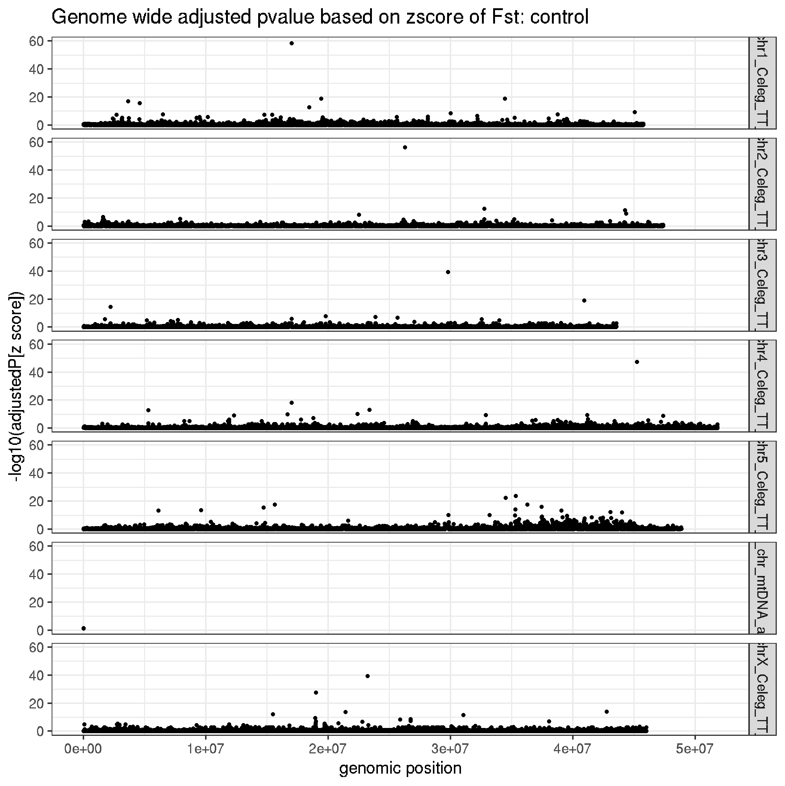
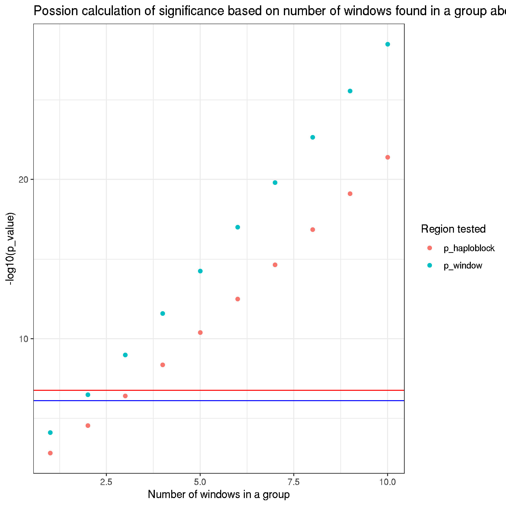

# XQTL supplementary data - looking a fst distribution, and cutoffs

```bash
# working dir:
cd /nfs/users/nfs_s/sd21/lustre118_link/hc/XQTL/04_VARIANTS
```

```R
# load libraries
library(ggplot2)
library(ggridges)
library(dplyr)
library(patchwork)

# get data
control <- read.table("XQTL_CONTROL/XQTL_CONTROL.merged.fst",header=F)
bz <- read.table("XQTL_BZ/XQTL_BZ.merged.fst",header=F)
lev <- read.table("XQTL_LEV/XQTL_LEV.merged.fst",header=F)
ivm <- read.table("XQTL_IVM/XQTL_IVM.merged.fst",header=F)

# add labels, extract relevant data, before merging
control$id <- "1. Control"
bz$id <- "2. Benzimidazole treated"
lev$id <- "3. Levamisole treated"
ivm$id <- "4. Ivermectin treated"

control <- select(control,c(V1,V2,V13,id))
bz <- select(bz,c(V1,,V2,V13,id))
lev <- select(lev,c(V1,V2,V13,id))
ivm <- select(ivm,c(V1,V2,V13,id))

data <- bind_rows(control, bz, lev, ivm)
data <- data[data$V1!="hcontortus_chr_mtDNA_arrow_pilon",]


vline.data <- data %>%
              group_by(id) %>%
              summarize(mean_fst_3sd = mean(V13)+3*sd(V13))

# plot
fst_distribution_plot <- ggplot(data,aes(V13,id)) +
     geom_density_ridges(aes(fill = id),scale = 1) + xlim(0,0.05) +
     geom_vline(aes(xintercept = mean_fst_3sd, col = id), vline.data, size = 1, linetype = "dashed") +
     scale_y_discrete(limits = rev(data$id)) +
     theme_bw() + theme(axis.ticks.y = element_blank(), axis.text.y = element_blank()) +
     labs(title="A", x = expression(paste("Genetic differentiation between pre- and post-treatment", " (",~italic(F)[ST],")", y="")))


# proportion of values above the control threshold
nrow(control[control$V13>0.0235,])/nrow(control)*100
= 1.033201

nrow(bz[bz$V13>0.0235,])/nrow(bz)*100
= 4.210414

nrow(lev[lev$V13>0.0235,])/nrow(lev)*100
= 11.21552

nrow(ivm[ivm$V13>0.0235,])/nrow(ivm)*100
= 2.399702


# positions of variants gt fst+3sd
bz_high <- bz %>% filter(V13 > mean(V13)+3*sd(V13))
control_bz_high <- dplyr::inner_join(control, bz_high, by = c("V1","V2"))
#> control_bz_high = 712

# false positives
control_bz_high_control_high <- control_bz_high %>% filter(V13.x > mean(control$V13)+3*sd(control$V13))
#> 21 gt control

nrow(control_bz_high_control_high)/nrow(control_bz_high)
#> 0.02949438

# positions of variants gt fst+3sd
lev_high <- lev %>% filter(V13 > mean(V13)+3*sd(V13))
control_lev_high <- dplyr::inner_join(control, lev_high, by = c("V1","V2"))
nrow(control_lev_high)
#= 715

# false positives
control_lev_high_control_high <- control_lev_high %>% filter(V13.x > mean(control$V13)+3*sd(control$V13))
nrow(control_lev_high_control_high)
#> 33 gt control

nrow(control_lev_high_control_high)/nrow(control_lev_high)
#> 0.04615385

# positions of variants gt fst+3sd
ivm_high <- ivm %>% filter(V13 > mean(V13)+3*sd(V13))
control_ivm_high <- dplyr::inner_join(control, ivm_high, by = c("V1","V2"))
nrow(control_ivm_high)
#= 698

# false positives
control_ivm_high_control_high <- control_ivm_high %>% filter(V13.x > mean(control$V13)+3*sd(control$V13))
nrow(control_ivm_high_control_high)
#> 39 gt control

nrow(control_ivm_high_control_high)/nrow(control_ivm_high)
#> 0.05587393


data2 <- bind_rows(control_bz_high, control_lev_high, control_ivm_high)


# make false positive plot
fp_plot <- ggplot(data2,aes(V13.x,1)) +
     geom_jitter(aes(color = V13.x > mean(control$V13)+3*sd(control$V13), size = V13.x > mean(control$V13)+3*sd(control$V13)))+ xlim(0,0.05) +
     scale_size_manual(values = c("TRUE" = 1, "FALSE" = 0.3), guide = "none")+
     scale_color_manual(values = c("TRUE" = "red", "FALSE" = "black"))+
     theme_bw() + theme(axis.ticks.y = element_blank(), axis.text.y = element_blank()) +
     labs(title = "B", x = expression(paste("Genetic differentiation between pre- and post-treatment", " (",~italic(F)[ST],")")), colour="False positive", size="", y="")+
     facet_grid(id.y~.)

# bring the plots together
fst_distribution_plot + fp_plot + plot_layout(ncol = 1)

# save it
ggsave("xqtl_fdr.png")
```

- A. Fst distribution for each group, showing position of meanFst+3sd (vertical dashed line, coloured by treatment group)
     - Proportion of treatment data above meanFst+3sd of control
          - control = ~ 1.03%
               - close to 1% as expected but perhaps increased slightly due to skew
          - benzimidazole = ~4.2%
          - levamisole = ~11.2%
          - ivermectin = ~2.4%
               - suggests that there shift in the distribution with treatment, with an increase in data above that of the control

- B. For positions above the meanFst+3sd threshold, the Fst for the equivalent genomic position in the control dataset is shown. Points are coloured black, except for points that are above the control meanFst+3sd which are indicated in red. These red points represent the false positive fraction, ie. highly differentated in both the control and treated group
     - FDR: high_Fst(treated & control) / high_Fst(treated)
          - benzimidazole = 0.02949438 or ~2.9%
          - levamisole = 0.04615385 or ~4.6%
          - ivermectin = 0.05587393 or ~5.6%
               - suggests that of the data above the threshold in each group, between 2.9 and 5.6 % represent false positives


```R
# pairwise KS test to compare distributions

library(dgof)

ks.test(control$V13, bz$V13, alternative = "two.sided")
#> data:  control$V13 and bz$V13
#> D^- = 0.0076465, p-value = 0.03707

ks.test(control$V13, lev$V13, alternative = "l")


# pariwise comparison using qqplot
library(ggplot2)

qq.out <- qqplot(control$V13, bz$V13, plot.it=FALSE)
qq.out <- as.data.frame(qq.out)

xylim <- range( c(qq.out$x, qq.out$y) )

ggplot(qq.out, aes( x= x, y = y)) +
      geom_point() +
      geom_abline( intercept=0, slope=1) +
      coord_fixed(ratio = 1, xlim=xylim, ylim = xylim)
```
```R
# comparison of sample vs theoretical distribution in qqplot
require(qqplotr)
# https://cran.r-project.org/web/packages/qqplotr/vignettes/introduction.html

plot_multi_qq <- ggplot(data = data, mapping = aes(sample = V13, color = id, fill = id)) +
    stat_qq_band(alpha=0.5) +
    stat_qq_line() +
    stat_qq_point() +
    facet_wrap(~ id) +
    labs(x = "Theoretical Quantiles", y = "Sample Quantiles")
plot_multi_qq

# save it
ggsave("xqtl_multi_qq.png")
```


```R
# calculate zscores
control2 <- control %>% mutate(zscore = (V13 - mean(V13))/sd(V13))

bz2 <- bz %>% mutate(zscore = (V13 - mean(V13))/sd(V13))

lev2 <- lev %>% mutate(zscore = (V13 - mean(V13))/sd(V13))

ivm2 <- ivm %>% mutate(zscore = (V13 - mean(V13))/sd(V13))


# zscore to pvalue
control2$pnorm <- 2*pnorm(-abs(control2$zscore))

bz2$pnorm <- 2*pnorm(-abs(bz2$zscore))

lev2$pnorm <- 2*pnorm(-abs(lev2$zscore))

ivm2$pnorm <- 2*pnorm(-abs(ivm2$zscore))


# adjusted pvalue - FDR
control2$padjust <- p.adjust(control2$pnorm,method="fdr")

bz2$padjust <- p.adjust(bz2$pnorm,method="fdr")

lev2$padjust <- p.adjust(lev2$pnorm,method="fdr")

ivm2$padjust <- p.adjust(ivm2$pnorm,method="fdr")


# plot it
ggplot(control2,aes(V2,-log10(pnorm)))+geom_point()+facet_grid(V1~.)+ylim(0,60)+labs(title="Control", y="-log10(adjustedP[z score])", x= "genomic position")
ggsave("xqtl_control_Fst_adjustedP.png")
ggplot(bz2,aes(V2,-log10(pnorm)))+geom_point()+facet_grid(V1~.)+ylim(0,60)+labs(title="Benzimidazole", y="-log10(adjustedP[z score])", x= "genomic position")
ggsave("xqtl_bz_Fst_adjustedP.png")
ggplot(lev2,aes(V2,-log10(pnorm)))+geom_point()+facet_grid(V1~.)+ylim(0,60)+labs(title="Levamisole", y="-log10(adjustedP[z score])", x= "genomic position")
ggsave("xqtl_lev_Fst_adjustedP.png")
ggplot(ivm2,aes(V2,-log10(pnorm)))+geom_point()+facet_grid(V1~.)+ylim(0,60)+labs(title="Ivermectin", y="-log10(adjustedP[z score])", x= "genomic position")
ggsave("xqtl_ivm_Fst_adjustedP.png")
```



```R
apply(bz,1, function(x) { sum(control$V13 >= x['V13']) / length(control$V13) } )
with(bz, sum(control$V13 >= bz$V13)/length(control$V13))


sample1 <- rnorm(10000, 10, 5)
sample2 <- rnorm(10000, 1, 5)
group <- c(rep("sample1", length(sample1)), rep("sample2", length(sample2)))
dat <- data.frame(KSD = c(sample1,sample2), group = group)
# create ECDF of data
cdf1 <- ecdf(sample1)
cdf2 <- ecdf(sample2)

sample1 <- control$V13
sample2 <- bz$V13
sample3 <- lev$V13
sample4 <- ivm$V13
group <- c(rep("sample1", length(sample1)), rep("sample2", length(sample2)), rep("sample3", length(sample3)), rep("sample4", length(sample4)))
dat <- data.frame(KSD = c(sample1,sample2, sample3,sample4), group = group)

minMax <- seq(min(sample1, sample2, sample3, sample4), max(sample1, sample2, sample3, sample4), length.out=length(sample1))


ggplot(dat, aes(x = KSD, group = group, color = group))+
  stat_ecdf(size=1) +
    theme_bw(base_size = 28) +
    theme(legend.position ="top") +
    xlab("Sample") +
    ylab("ECDF") +
    theme(legend.title=element_blank())
```


# Estimation of haplotype blocks in the XQTL experiment
- Aim: estimate average haplotype block length that would be maintained from the parental population to the sampled F3
- Rationale: want to know what the minimum QTL size in genome, below which is likely to be noise, above which provides greater confidence of a selective sweep  

Overview (see cross design schematic of XQTL paper)
- 100 P0 susceptible females X 100 P0 resistant males
- 5000 F1 progeny used for passage (F2 progeny will be 1st generation of recombinants)
- X F2 adults producing 2x200 F3 L3 samples which were sequenced (F3 progeny will be 2nd generation of recombinants)

```R
# 5000 F1 parasites were using in the passage
f1_autosomes <- 2 * 5000 * 5

# from genetic map, expect 0.69 crossovers per chromosome on average
crossovers <- 0.69
f2_recombinants <- crossovers * f1_autosomes

#> 34,500 F2 recombination events

# 5000 F3 parasites sampled from treated F2 adults
f2_autosomes <- 2 * 400 * 5
f3_recombinants <- crossovers * f2_autosomes
#> 2760 F3 recombination events

# total recombination events

total_recombinants <- f2_recombinants + f3_recombinants


# PER POPULATION of 400 sampled
autosome_size <- 237412613

pop_haplotype_block <- (autosome_size * 2)/total_recombinants
#> 12743.56 bp

# PER INDIVIDUAL of the 400 sampled
co_per_indiv <- total_recombinants / 400
#> 93.15 recombination events per individual

indv_haplotype_block <- (autosome_size * 2) / co_per_indiv
#> 5.097 Mb haplotype blocks from parent in each individual
```


# poisson distribution calculation of groups of windows above threshold
```R


vline.data <- data %>%
              group_by(id) %>%
              summarize(mean_fst_3sd = mean(V13)+3*sd(V13))


sample <- bz

#
# frequency of a point about the threshold if randomly distributed in genome, based on number of total Fst windows
f_windows <- nrow(filter(sample, V13 > (mean(V13) + 3*sd(V13)))) / nrow(sample)

# frequency of a point about the threshold if randomly distributed in genome, based on expected haplotype block size
f_haplotypes <- nrow(filter(sample, V13 > (mean(V13) + 3*sd(V13)))) / pop_haplotype_block

# calculate pvalue from poisson
# ppois(1, lambda=bz_freq, lower=F)

# loop over values from 1 to 10
data  <- NULL;
for (i in 1:10)
 {
  p1[1] <- ppois(i, lambda=f_windows, lower=F)
  p1[2] <- i
  p2[1] <- ppois(i, lambda=f_haplotypes, lower=F)
  p2[2] <- i
  data <- rbind(data, p1, p2)
 }

myDF <- data.frame(name = row.names(data), data)
colnames(myDF) <- c("test","p_value","count")


ggplot(myDF,aes(count,-log10(p_value),col=test)) +
     geom_point() +
     #facet_grid(test~.) +
     theme_bw() +
     geom_hline(yintercept=-log10((0.01/nrow(sample))),col="red") +
     geom_hline(yintercept=-log10((0.01/pop_haplotype_block)),col="blue")+
     labs(title="Possion calculation of significance based on number of windows found in a group above a threshold", x="Number of windows in a group", col="Windows (red) \nv Haploblocks (blue)")

# save it
ggsave("xqtl_poisson_windows_sig.png")
```

- note: threshold is bonferroni threshold at 0.01 basde on number of windows (red) or haploblocks (blue)
- suggests three windows above threshold sufficiently significant
- also suggests could colour runs of windows by significance value.


# reverse calculation of a Fst cutoff based on a bonferroni correction
```R
# calculate zscore from a pvalue. In this case, a bonferroni-like value using number of haplotype blocks
zscore <- qnorm(0.05/pop_haplotype_block)/2

# rearrange zscore equation to find V13, which will be Fst in this case
#zscore = (V13 - mean(V13))/sd(V13)
#> zscore * sd(V13) + mean(V13) = V13

# calculate the Fst cutoff
fst_cutoff <- abs(zscore) * sd(sample$V13) + mean(sample$V13)
#> 0.02692197
```
- this is too stringent. None of the Fst data would pass.


#
```R
sample <- bz
sig_values <- filter(sample, V13 > (mean(V13) + 3*sd(V13)))
sig_values <- sig_values %>% mutate(V2 = as.numeric(V2))
sig_values <- select(sig_values,"V2")

#https://stackoverflow.com/questions/16118050/how-to-check-if-a-vector-contains-n-consecutive-numbers
seqle <- function(x,incr=5000) {
  if(!is.numeric(x)) x <- as.numeric(x)
  n <- length(x)  
  y <- x[-1L] != x[-n] + incr
  i <- c(which(y|is.na(y)),n)
  list(lengths = diff(c(0L,i)),
       values = x[head(c(0L,i)+1L,-1L)])
}


seqle <- function(x,incr=5000) {
  if(!is.numeric(x[2])) x[2] <- as.numeric(x[2])
  n <- length(x[2])  
  y <- x[-1L] != x[-n] + incr
  i <- c(which(y|is.na(y)),n)
  list(lengths = diff(c(0L,i)),
       values = x[2][head(c(0L,i)+1L,-1L)])
}

test <- seqle((unlist(sig_values$V2)))
ggplot(test, aes(values, lengths)) + geom_point() + facet_grid()
```
