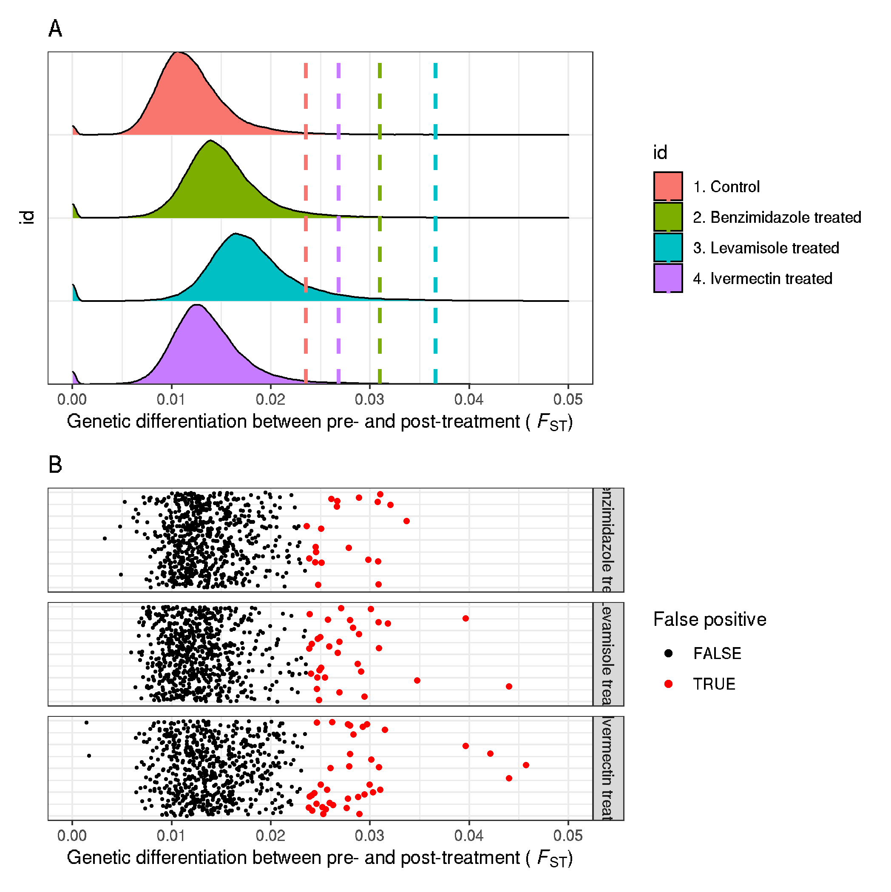

# XQTL supplementary data - looking a fst distribution, and cutoffs

```bash
# working dir:
cd /nfs/users/nfs_s/sd21/lustre118_link/hc/XQTL/04_VARIANTS
```

```R
# load libraries
library(ggplot2)
library(ggridges)
library(dplyr)
library(patchwork)

# get data
control <- read.table("XQTL_CONTROL/XQTL_CONTROL.merged.fst",header=F)
bz <- read.table("XQTL_BZ/XQTL_BZ.merged.fst",header=F)
lev <- read.table("XQTL_LEV/XQTL_LEV.merged.fst",header=F)
ivm <- read.table("XQTL_IVM/XQTL_IVM.merged.fst",header=F)

# add labels before merging
control$id <- "1. Control"
bz$id <- "2. Benzimidazole treated"
lev$id <- "3. Levamisole treated"
ivm$id <- "4. Ivermectin treated"

control <- select(control,c(V1,V2,V13,id))
bz <- select(bz,c(V1,,V2,V13,id))
lev <- select(lev,c(V1,V2,V13,id))
ivm <- select(ivm,c(V1,V2,V13,id))

data <- bind_rows(control, bz, lev, ivm)
data <- data[data$V1!="hcontortus_chr_mtDNA_arrow_pilon",]


vline.data <- data %>%
              group_by(id) %>%
              summarize(mean_fst_3sd = mean(V13)+3*sd(V13))

# plot
fst_distribution_plot <- ggplot(data,aes(V13,id)) +
     geom_density_ridges(aes(fill = id),scale = 1) + xlim(0,0.05) +
     geom_vline(aes(xintercept = mean_fst_3sd, col = id), vline.data, size = 1, linetype = "dashed") +
     scale_y_discrete(limits = rev(data$id)) + theme_bw() +
     labs(title="A", x="FST")


# proportion of values above the control threshold
nrow(control[control$V13>0.0235,])/nrow(control)*100
= 1.033201

nrow(bz[bz$V13>0.0235,])/nrow(bz)*100
= 4.210414

nrow(lev[lev$V13>0.0235,])/nrow(lev)*100
= 11.21552

nrow(ivm[ivm$V13>0.0235,])/nrow(ivm)*100
= 2.399702


# positions of variants gt fst+3sd
bz_high <- bz %>% filter(V13 > mean(V13)+3*sd(V13))
control_bz_high <- dplyr::inner_join(control, bz_high, by = c("V1","V2"))
#> control_bz_high = 712

# false positives
control_bz_high_control_high <- control_bz_high %>% filter(V13.x > mean(control$V13)+3*sd(control$V13))
#> 21 gt control

nrow(control_bz_high_control_high)/nrow(control_bz_high)
#> 0.02949438

# positions of variants gt fst+3sd
lev_high <- lev %>% filter(V13 > mean(V13)+3*sd(V13))
control_lev_high <- dplyr::inner_join(control, lev_high, by = c("V1","V2"))
nrow(control_lev_high)
#= 715

# false positives
control_lev_high_control_high <- control_lev_high %>% filter(V13.x > mean(control$V13)+3*sd(control$V13))
nrow(control_lev_high_control_high)
#> 33 gt control

nrow(control_lev_high_control_high)/nrow(control_lev_high)
#> 0.04615385

# positions of variants gt fst+3sd
ivm_high <- ivm %>% filter(V13 > mean(V13)+3*sd(V13))
control_ivm_high <- dplyr::inner_join(control, ivm_high, by = c("V1","V2"))
nrow(control_ivm_high)
#= 698

# false positives
control_ivm_high_control_high <- control_ivm_high %>% filter(V13.x > mean(control$V13)+3*sd(control$V13))
nrow(control_ivm_high_control_high)
#> 39 gt control

nrow(control_ivm_high_control_high)/nrow(control_ivm_high)
#> 0.05587393


data2 <- bind_rows(control_bz_high, control_lev_high, control_ivm_high)


fp_plot <- ggplot(data2,aes(V13.x,1)) +
     geom_jitter(aes(color = V13.x > mean(control$V13)+3*sd(control$V13), size = V13.x > mean(control$V13)+3*sd(control$V13)))+ xlim(0,0.05) +
     scale_size_manual(values = c("TRUE" = 1, "FALSE" = 0.3), guide = "none")+
     scale_color_manual(values = c("TRUE" = "red", "FALSE" = "black"))+
     theme_bw() +
     labs(title = "B", x="FST", colour="False positive", size="", y="")+
     facet_grid(id.y~.)

fst_distribution_plot + fp_plot + plot_layout(ncol = 1)
ggsave("xqtl_fdr.png")
```

- A. Fst distribution for each group, showing position of meanFst+3sd
- B. For positions above the meanFst+3sd threshold, the Fst for the equivalent position in the control dataset is shown. Points are coloured black, except for points that are above the control meanFst+3sd which are indicated in red. These red points represent the false positives.
     - FDR: high_Fst(treated & control) / high_Fst(treated)
          - benzimidazole = 0.02949438 or ~2.9%
          - levamisole = 0.04615385 or ~4.6%
          - ivermectin = 0.05587393 or ~5.6%
