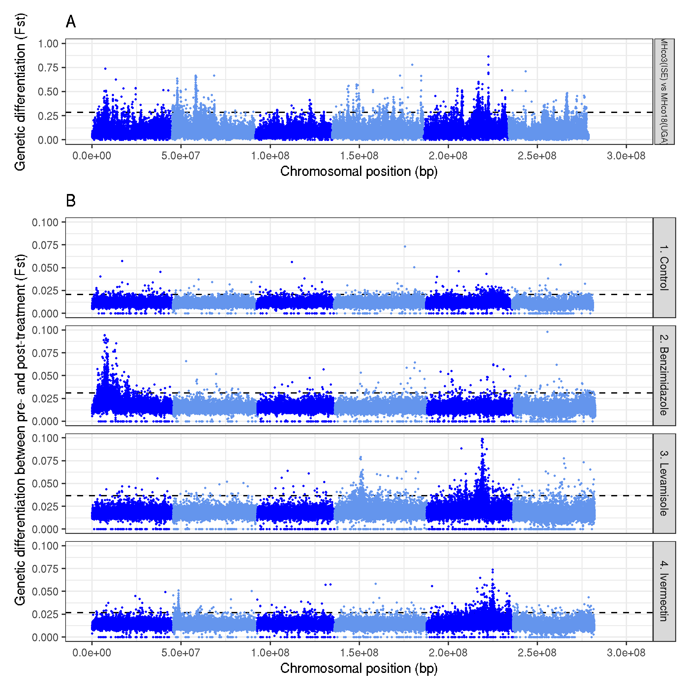

# Figure 2 - Fst plot for parent strains

1. [Figure 2 A](#figure2a)
2. [Figure 2 B](#figure2b)


---
## Figure 2 A <a name="figure2a"></a>

Aim is to show genetic differenation between the two parental strains,  MHco3(ISE) and MHco18(UGA)

```shell
working dir:
cd /nfs/users/nfs_s/sd21/lustre118_link/hc/XQTL/05_ANALYSIS/GENOMEWIDE
```

```R
# load required libaries
library(ggplot2)
library(patchwork)
library(dplyr)

# reformat the data
parents <- read.table("XQTL_PARENTS.merged.fst",  header = F)
parents <- parents[parents$V1 != "hcontortus_chr_mtDNA_arrow_pilon",  ]
parents <- dplyr::select(parents,  V1,  V2,  V7)
colnames(parents) <- c("CHR",  "POS",  "FST")
parents$LABEL <- "MHco3(ISE) vs MHco18(UGA)"
parents$ROW_ID <- 1:nrow(parents)
colnames(parents) <- c("CHR",  "POS",  "FST",  "LABEL",  "ROW_ID")

data <- parents

# genome wide significance per sample
data_gws <- data %>%
    group_by(LABEL) %>%
    summarise(GWS = mean(FST) + 3*sd(FST))

# chromosome colours
chr_colours <- c("blue", "cornflowerblue", "blue", "cornflowerblue", "blue", "cornflowerblue")

# make the plot
plot_a <- ggplot(data)+
     geom_hline(data = data_gws,  aes(yintercept = GWS),  linetype = "dashed",  col = "black") +
     geom_point(aes(ROW_ID * 5000,  FST,  colour = CHR,  group = LABEL),  size = 0.1) +
     ylim(0, 1) +
     labs(title = "A",  x = "Chromosomal position (bp)",  y = "Genetic differentiation (Fst)") +
     scale_color_manual(values = chr_colours) +
     scale_x_continuous(breaks = seq(0,  3e8,  0.5e8), limits = c(0,  300e6)) +
     theme_bw() + theme(legend.position = "none",  text = element_text(size = 10), strip.text.y = element_text(size = 7)) +
     facet_grid(LABEL ~ .)

```

## Figure 2 B <a name="figure2b"></a>

Aim is to show genetic differentiation between pre and post treatment F3 generation for each of the control,  benzimidazole,  levamisole,  and ivermectin XQTL datasets

```R
# load required libraries
library(ggplot2)
library(patchwork)
library(dplyr)


# control
control <- read.table("XQTL_CONTROL.merged.fst", header=F)
control <- control[control$V1!="hcontortus_chr_mtDNA_arrow_pilon", ]
control <- dplyr::select(control,  V1,  V2,  V11)
colnames(control) <- c("CHR",  "POS",  "FST")
control$LABEL <- "1. Control"
control$ROW_ID <- 1:nrow(control)
colnames(control) <- c("CHR",  "POS",  "FST",  "LABEL",  "ROW_ID")

# benzimidazole
bz <- read.table("XQTL_BZ.merged.fst", header = F)
bz <- bz[bz$V1 != "hcontortus_chr_mtDNA_arrow_pilon", ]
bz <- dplyr::select(bz,  V1,  V2,  V13)
colnames(bz) <- c("CHR", "POS", "FST")
bz$LABEL <- "2. Benzimidazole"
bz$ROW_ID <- 1:nrow(bz)
colnames(bz) <- c("CHR", "POS", "FST", "LABEL", "ROW_ID")

data <- dplyr::bind_rows(control, bz)


# levamisole
lev <- read.table("XQTL_LEV.merged.fst", header = F)
lev <- lev[lev$V1 != "hcontortus_chr_mtDNA_arrow_pilon", ]
lev <- dplyr::select(lev,  V1,  V2,  V13)
colnames(lev) <- c("CHR", "POS", "FST")
lev$LABEL <- "3. Levamisole"
lev$ROW_ID <- 1:nrow(lev)
colnames(lev) <- c("CHR", "POS", "FST", "LABEL", "ROW_ID")

data <- dplyr::bind_rows(data, lev)

#ivermectin
ivm <- read.table("XQTL_IVM.merged.fst", header = F)
ivm <- ivm[ivm$V1 != "hcontortus_chr_mtDNA_arrow_pilon", ]
ivm <- dplyr::select(ivm,  V1,  V2,  V13)
colnames(ivm) <- c("CHR", "POS", "FST")
ivm$LABEL <- "4. Ivermectin"
ivm$ROW_ID <- 1:nrow(ivm)
colnames(ivm) <- c("CHR", "POS", "FST", "LABEL", "ROW_ID")

data <- dplyr::bind_rows(data, ivm)


# genome wide signficance per sample
data_gws <- data %>%
    group_by(LABEL) %>%
    summarise(GWS = mean(FST) + 3*sd(FST))


# set the colours
chr_colours<-c("blue", "cornflowerblue", "blue", "cornflowerblue", "blue", "cornflowerblue")

# make the plot
plot_b <- ggplot(data) +
     geom_hline(data = data_gws,  aes(yintercept = GWS),  linetype = "dashed", col = "black") +
     geom_point(aes(ROW_ID * 5000,  FST,  colour = CHR,  group = LABEL), size = 0.1) +
     ylim(0, 0.1) +
     labs(title = "B", x = "Chromosomal position (bp)",  y = "Genetic differentiation between pre- and post-treatment (Fst)") +
     scale_color_manual(values = chr_colours) +
     scale_x_continuous(breaks = seq(0, 3e8, 0.5e8), limits = c(0, 300e6)) +
     theme_bw() + theme(legend.position = "none", text = element_text(size=10)) +
     facet_grid(LABEL ~ .)


# combine the parental and XQTL plots into a single figure
plot_a + plot_b + plot_layout(ncol = 1,  heights = c(1, 4))

# save it
ggsave("genomewide_fst_plots.pdf", useDingbats = FALSE, width = 170, height = 200, units = "mm")
ggsave("genomewide_fst_plots.png")
```



### other stuff that wasn't used but worth keeping
<!-- ```R
R
library(ggplot2)

# get data
data <- read.table("XQTL_PARENTS.merged.fst", header=F)
data <- data[data$V1!="hcontortus_chr_mtDNA_arrow_pilon", ]

data$LABEL <- "Parents: MHco3(ISE) vs MHco18(UGA)"
# genome wide levels of significance


chr_colours<-c("blue", "cornflowerblue", "blue", "cornflowerblue", "blue", "cornflowerblue")

fst_column <- data$V7

genomewide_sig <- mean(fst_column)+(3*sd(fst_column))

plot_a <- ggplot(data)+
     geom_hline(yintercept=genomewide_sig,  linetype="dashed", col="black")+
     geom_point(aes(1:nrow(data)*5000,  fst_column,  colour = V1), size=0.1)+
     ylim(0, 1)+
     labs(title="A", x="Chromosome position (5 kbp window)",  y="Genetic differentiation (Fst)")+
     scale_color_manual(values=chr_colours)+
     scale_x_continuous(breaks=seq(0, 3e8, 0.5e8))+
     theme_bw()+theme(legend.position="none", text = element_text(size=10))+
     facet_grid(LABEL~.)


#ggsave("XQTL_parents_fst.pdf", useDingbats=FALSE, width=170, height=50, units="mm")

```

```R
R
library(ggplot2)

# get data
data <- read.table("XQTL_CONTROL.merged.fst", header=F)
data <- data[data$V1!="hcontortus_chr_mtDNA_arrow_pilon", ]
data$LABEL <- "Control"
# genome wide levels of significance


chr_colours<-c("blue", "cornflowerblue", "blue", "cornflowerblue", "blue", "cornflowerblue")

# Replicates
# 1:4 = V11
# 2:5 = V21
# 3:6 = V29

fst_column <- data$V11

genomewide_sig <- mean(fst_column)+(3*sd(fst_column))

plot_b <- ggplot(data)+
     geom_hline(yintercept=genomewide_sig,  linetype="dashed", col="black")+
     geom_point(aes(1:nrow(data)*5000,  fst_column,  colour = V1), size=0.1)+
     ylim(0, 0.1)+
     labs(title="B", x="Chromosome position (5 kbp window)",  y="Genetic differentiation (Fst)")+
     scale_color_manual(values=chr_colours)+
     scale_x_continuous(breaks=seq(0, 3e8, 0.5e8))+
     theme_bw()+theme(legend.position="none", text = element_text(size=10))+
     facet_grid(LABEL~.)

```
```R
R
library(ggplot2)

# get data
data <- read.table("XQTL_BZ.merged.fst", header=F)
data <- data[data$V1!="hcontortus_chr_mtDNA_arrow_pilon", ]
data$LABEL <- "Benzimidazole"
# genome wide levels of significance


chr_colours<-c("blue", "cornflowerblue", "blue", "cornflowerblue", "blue", "cornflowerblue")

# Replicates
# 1:5 = V13
# 2:6 = V27
# 3:7 = V39
# 4:8 = V49


fst_column <- data$V13

genomewide_sig <- mean(fst_column)+(3*sd(fst_column))

plot_c <- ggplot(data)+
     geom_hline(yintercept=genomewide_sig,  linetype="dashed", col="black")+
     geom_point(aes(1:nrow(data)*5000,  fst_column,  colour = V1), size=0.1)+
     ylim(0, 0.1)+
     labs(title="C", x="Chromosome position (5 kbp window)",  y="Genetic differentiation (Fst)")+
     scale_color_manual(values=chr_colours)+
     scale_x_continuous(breaks=seq(0, 3e8, 0.5e8))+
     theme_bw()+theme(legend.position="none", text = element_text(size=10))+
     facet_grid(LABEL~.)
```

```R
R
library(ggplot2)

# get data
data <- read.table("XQTL_LEV.merged.fst", header=F)
data <- data[data$V1!="hcontortus_chr_mtDNA_arrow_pilon", ]
data$LABEL <- "Levamisole"
# genome wide levels of significance


chr_colours<-c("blue", "cornflowerblue", "blue", "cornflowerblue", "blue", "cornflowerblue")

# Replicates
# 1:5 = V13
# 2:6 = V27
# 3:7 = V39
# 4:8 = V49


fst_column <- data$V13

genomewide_sig <- mean(fst_column)+(3*sd(fst_column))

plot_d <- ggplot(data)+
     geom_hline(yintercept=genomewide_sig,  linetype="dashed", col="black")+
     geom_point(aes(1:nrow(data)*5000,  fst_column,  colour = V1), size=0.1)+
     ylim(0, 0.1)+
     labs(title="D", x="Chromosome position (5 kbp window)",  y="Genetic differentiation (Fst)")+
     scale_color_manual(values=chr_colours)+
     scale_x_continuous(breaks=seq(0, 3e8, 0.5e8))+
     theme_bw()+theme(legend.position="none", text = element_text(size=10))+
     facet_grid(LABEL~.)
```

## Ivermectin
```R
R
library(ggplot2)

# get data
data <- read.table("XQTL_IVM.merged.fst", header=F)
data <- data[data$V1!="hcontortus_chr_mtDNA_arrow_pilon", ]
data$LABEL <- "Ivermectin"
# genome wide levels of significance


chr_colours<-c("blue", "cornflowerblue", "blue", "cornflowerblue", "blue", "cornflowerblue")

# Replicates
# 1:5 = V13
# 2:6 = V27
# 3:7 = V39
# 4:8 = V49


fst_column <- data$V13

genomewide_sig <- mean(fst_column)+(3*sd(fst_column))

plot_e <- ggplot(data)+
     geom_hline(yintercept=genomewide_sig,  linetype="dashed", col="black")+
     geom_point(aes(1:nrow(data)*5000,  fst_column,  colour = V1), size=0.1)+
     ylim(0, 0.1)+
     labs(title="E", x="Chromosome position (5 kbp window)",  y="Genetic differentiation (Fst)")+
     scale_color_manual(values=chr_colours)+
     scale_x_continuous(breaks=seq(0, 3e8, 0.5e8))+
     theme_bw()+theme(legend.position="none", text = element_text(size=10))+
     facet_grid(LABEL~.)
```

# bring it together
```R
library(patchwork)
plot_a + plot_b + plot_c + plot_d + plot_e + plot_layout(ncol=1)


``` -->
