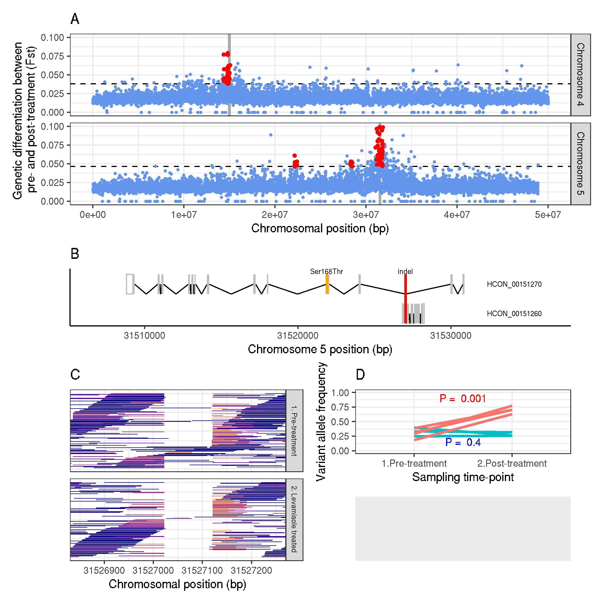

#-------------------------------------------------------------------------------
# Figure 4 - levamisole analyses

working dir:
cd /nfs/users/nfs_s/sd21/lustre118_link/hc/XQTL/05_ANALYSIS/LEV

```R
R
library(ggplot2)
library(dplyr)


lev <- read.table("XQTL_LEV.merged.fst", header = F)
lev <- lev[lev$V1! = "hcontortus_chr_mtDNA_arrow_pilon", ]
lev <- dplyr::select(lev, V1, V2, V13)
colnames(lev) <- c("CHR", "POS", "FST")
lev$LABEL <- "3. F2: Levamisole"
lev$ROW_ID <- 1:nrow(lev)


lev_chr4 <- lev[lev$CHR = = "hcontortus_chr4_Celeg_TT_arrow_pilon", ]
lev_chr5 <- lev[lev$CHR = = "hcontortus_chr5_Celeg_TT_arrow_pilon", ]

data <- dplyr::bind_rows(lev_chr4, lev_chr5)

# make the XQTL plot
chr_colours<-c("cornflowerblue")

# genome wide signficance per sample
data_gws <- data %>%
  group_by(CHR) %>%
  summarise(GWS = mean(FST) + 3*sd(FST))


peaks <- read.table("XQTL_LEV.peak_windows", header = T)

genes <- read.table("candidategenes.data", header = T)

plot_a <- ggplot(data)+
   geom_hline(data = data_gws, aes(yintercept = GWS), linetype = "dashed", col = "black")+
   geom_vline(data = genes, aes(xintercept = POS), linetype = "dotted", col = "darkgrey", size = 1)+
   geom_point(aes(POS, FST, group = CHR), size = 0.5, col = "cornflowerblue")+
   geom_point(data = subset(data, (data$POS >= peaks$PEAK_START_COORD[1]) & (data$POS < = peaks$PEAK_END_COORD[1]) & (FST > data_gws$GWS[1])), aes(POS, FST), col = "red", size = 1)+
   geom_point(data = subset(data, (data$POS >= peaks$PEAK_START_COORD[2]) & (data$POS < = peaks$PEAK_END_COORD[2]) & (FST > data_gws$GWS[2])), aes(POS, FST), col = "red", size = 1)+
   geom_point(data = subset(data, (data$POS >= peaks$PEAK_START_COORD[3]) & (data$POS < = peaks$PEAK_END_COORD[3]) & (FST > data_gws$GWS[2])), aes(POS, FST), col = "red", size = 1)+
   geom_point(data = subset(data, (data$POS >= peaks$PEAK_START_COORD[4]) & (data$POS < = peaks$PEAK_END_COORD[4]) & (FST > data_gws$GWS[2])), aes(POS, FST), col = "red", size = 1)+
   ylim(0, 0.1)+xlim(0, 50e6)+
   labs(title = "A", x = "Chromosome position (5 kbp window)", y = "Genetic differentiation (Fst)")+
   theme_bw()+theme(legend.position = "none", text = element_text(size = 10))+
   facet_grid(CHR~.)

plot_a
```

#------


## 03 - Gene model plotter <a name = "gene_model_plotter"></a>

Working environment and data

```shell
# working dir:
cd /nfs/users/nfs_s/sd21/lustre118_link/hc/XQTL/05_ANALYSIS/LEV

#gff
ln -fs /nfs/users/nfs_s/sd21/lustre118_link/hc/GENOME/TRANSCRIPTOME/TRANSCRIPTOME_CURATION/20200407/UPDATED_annotation.gff3 ANNOTATION.gff


```


```R
#install.packages("data.table")
#if (!requireNamespace("BiocManager", quietly = TRUE))
# install.packages("BiocManager")
#BiocManager::install("ggbio", version = "3.8")

library(data.table)
library(ggplot2)
library(dplyr)

# load data
# --- genome annotation
gff<-fread(cmd = "grep ^hcontortus ANNOTATION.gff")
colnames(gff) <- c("chr", "source", "feature", "start", "end", "point1", "strand", "frame", "info")


# select gene ID - ACR-8
gene1 = 'HCON_00151270'
gene2 = 'HCON_00151260'


# filter data to select chromosome and mRNA
mrna1_data <- gff[grep(gene1, gff$info), ]
mrna1_data <- mrna1_data[mrna1_data$feature = = 'mRNA', ]
mrna1_data <- cbind(mrna1_data, read.table(text = as.character(mrna1_data$info), sep = ";"))
mrna1_data <- cbind(mrna1_data, read.table(text = as.character(mrna1_data$V3), sep = "=", col.names = c("ID", "unique_ID")))
mrna1_id <- head(data.frame(mrna1_data$unique_ID), 1) # gives 1st isoform if multiple
chromosome <- mrna1_data[1, 1]
colnames(chromosome)<-c("chromosome_ID")

data1 <- gff[grep(mrna1_id$mrna1_data.unique_ID, gff$info), ]

# filter by feature type
cds1 <- data1[data1$feature == "CDS", ]
mrna1 <- data1[data1$feature == "mRNA", ]
#gene <- data[data$feature == "gene", ]


intron1<-data.frame(head(cds1$end, -1), tail(cds1$start, -1), (tail(cds1$start, -1)-head(cds1$end, -1))/2)
colnames(intron1)<-c("start", "end", "midpoint")

utr5<-data.frame(head(mrna1$start, 1), head(sort(cds1$start), 1))
colnames(utr5)<-c("start", "end")
utr3<-data.frame(head(mrna1$end, 1), tail(sort(cds1$end), 1))
colnames(utr3)<-c("start", "end")
utr1<-rbind(utr5, utr3)


mrna2_data <- gff[grep(gene2, gff$info), ]
mrna2_data <- mrna2_data[mrna2_data$feature = = 'mRNA', ]
mrna2_data <- cbind(mrna2_data, read.table(text = as.character(mrna2_data$info), sep = ";"))
mrna2_data <- cbind(mrna2_data, read.table(text = as.character(mrna2_data$V3), sep = " = ", col.names = c("ID", "unique_ID")))
mrna2_id <- head(data.frame(mrna2_data$unique_ID), 1) # gives 1st isoform if multiple
chromosome <- mrna2_data[1, 1]
colnames(chromosome)<-c("chromosome_ID")

data2 <- gff[grep(mrna2_id$mrna2_data.unique_ID, gff$info), ]

# filter by feature type
cds2 <- data2[data2$feature = = "CDS", ]
mrna2 <- data2[data2$feature = = "mRNA", ]
#gene <- data[data$feature = = "gene", ]


intron2<-data.frame(head(cds2$end, -1), tail(cds2$start, -1), (tail(cds2$start, -1)-head(cds2$end, -1))/2)
colnames(intron2)<-c("start", "end", "midpoint")

utr52<-data.frame(head(mrna2$start, 1), head(sort(cds2$start), 1))
colnames(utr52)<-c("start", "end")
utr32<-data.frame(head(mrna2$end, 1), tail(sort(cds2$end), 1))
colnames(utr32)<-c("start", "end")
utr2<-rbind(utr52, utr32)


# deletion coordinates (size)
# 31527022 to 31527119 (97 bp) / 31527121 (99 bp)


# make plot
plot_b <- ggplot()+
#gene1
 geom_rect(data = utr1, aes(xmin = utr1$start, ymin = 0.5, xmax = utr1$end, ymax = 1.5), fill = NA, col = "grey", size = 0.4)+
 geom_segment(data = intron1, aes(x = intron1$start, xend = intron1$start + intron1$midpoint, y = 1, yend = 1.5), size = 0.5)+
 geom_segment(data = intron1, aes(x = intron1$start + intron1$midpoint, xend = intron1$end, y = 1.5, yend = 1), size = 0.5)+
 geom_rect(data = cds1, aes(xmin = cds1$start, ymin = 0.5, xmax = cds1$end, ymax = 1.5), fill = "grey", col = NA)+
 geom_text(aes(x = mrna1$end+(0.15*(mrna1$end-mrna1$start)), y = 1, label = gene1))+
 geom_segment(aes(x = 31521884, xend = 31521884, y = 0.5, yend = 1.5), size = 1, col = "orange")+ # Ser168Thr
 geom_text(aes(x = 31521884, y = 0.35), label = "Ser168Thr", size = 3.5)+
#gene2
 geom_rect(data = utr2, aes(xmin = utr2$start, ymin = 2, xmax = utr2$end, ymax = 3), fill = NA, col = "grey", size = 0.4)+
 geom_segment(data = intron2, aes(x = intron2$start, xend = intron2$start+intron2$midpoint, y = 2.5, yend = 3), size = 0.5)+
 geom_segment(data = intron2, aes(x = intron2$start+intron2$midpoint, xend = intron2$end, y = 3, yend = 2.5), size = 0.5)+
 geom_rect(data = cds2, aes(xmin = cds2$start, ymin = 2, xmax = cds2$end, ymax = 3), fill = "grey", col = NA)+
 geom_text(aes(x = mrna1$end+(0.15*(mrna1$end-mrna1$start)), y = 2.5, label = gene2))+
 # acr-8 indel
 geom_segment(aes(x = 31527022, xend = 31527022, y = 0.5, yend = 3), size = 1, col = "red")+
 geom_text(aes(x = 31527022, y = 0.35), label = "indel", size = 3.5)+
 #geom_rect(aes(xmin = 31527022, ymin = 0, xmax = 31527121, ymax = 3), fill = NA, col = "grey", size = 0.4)+
 # plot layout
 theme_classic()+
 #xlab("Genome position (bp)")+
 labs(title = "B", x = paste("Chromosome: ", chromosome, " position (bp)"))+
 xlim(mrna1$start-(0.1*(mrna1$end-mrna1$start)), mrna1$end+(0.25*(mrna1$end-mrna1$start)))+
 scale_y_reverse(lim = c(3, 0.35))+ scale_fill_discrete(guide = FALSE)+
 theme(axis.title.y = element_blank(),
    axis.text.y = element_blank(),
    axis.ticks.y = element_blank(),
    text = element_text(size = 10))

plot_b
```

#-------------------------------------------------------------------------------
# acr-8 deletion plot

```shell
# deletion coordinates (size)
31527022 to 31527119 (97 bp) / 31527121 (99 bp)
```

```R
R
library(GenomicAlignments)
library(viridis)
library(stringr)

pre_bam <- "pre.bam"
#pre_bam <- "XQTL_F3_L3_n200_LEV_pre_03_23241_8_1.merged.sorted.marked.realigned.bam"

data_pre <- as.data.frame(readGAlignmentPairs(pre_bam, use.names = TRUE, param = ScanBamParam(which = GRanges("hcontortus_chr5_Celeg_TT_arrow_pilon", IRanges(31525841, 31529149)))))
data_pre$number <- rep(1:100, length.out = nrow(data_pre))
data_pre$treatment <- "1. Pre-treatment"

post_bam <- "post.bam"
#post_bam <- "XQTL_F3_L3_n200_LEV_post_03_23241_8_2.merged.sorted.marked.realigned.bam"

data_post <- as.data.frame(readGAlignmentPairs(post_bam, use.names = TRUE, param = ScanBamParam(which = GRanges("hcontortus_chr5_Celeg_TT_arrow_pilon", IRanges(31525841, 31529149)))))
data_post$number <- rep(1:100, length.out = nrow(data_post))
data_post$treatment <- "2. Levamisole treated"

#data_ise <- as.data.frame(readGAlignmentPairs("ISE.bam", use.names = TRUE, param = ScanBamParam(which = GRanges("hcontortus_chr5_Celeg_TT_arrow_pilon", IRanges(31525841, 31529149)))))
#data_ise$number <- rep(1:100, length.out = nrow(data_ise))
#data_ise$treatment <- "1.ISE"

#data_uga <- as.data.frame(readGAlignmentPairs("UGA.bam", use.names = TRUE, param = ScanBamParam(which = GRanges("hcontortus_chr5_Celeg_TT_arrow_pilon", IRanges(31525841, 31529149)))))
#data_uga$number <- rep(1:100, length.out = nrow(data_uga))
#data_uga$treatment <- "2.UGA"

#data <- dplyr::bind_rows(data_ise, data_uga, data_pre, data_post)
data <- dplyr::bind_rows(data_pre, data_post)


softclip_match <- "([:digit:]{1, })S"

cigars1 <- data$cigar.first

softclip1_data <- str_extract(cigars1, softclip_match)
softclip1_data <- gsub("S", "", softclip1_data)
softclip1_data[is.na(softclip1_data)] <- 0
softclip1_data <- as.numeric(unlist(softclip1_data))

data$softclip1_length <- softclip1_data


cigars2 <- data$cigar.last
softclip2_match <- "([:digit:]{1, })S"
softclip2_data <- str_extract(cigars2, softclip_match)
softclip2_data <- gsub("S", "", softclip2_data)
softclip2_data[is.na(softclip2_data)] <- 0
softclip2_data <- as.numeric(unlist(softclip2_data))

data$softclip2_length <- softclip2_data


plot_c <- ggplot(data) +
   geom_rect(aes(xmin = start.first, ymin = number-0.4, xmax = end.first, ymax = number+0.4, fill = softclip1_length)) +
   geom_rect(aes(xmin = start.last, ymin = number-0.4, xmax = end.last, ymax = number+0.4, fill = softclip2_length)) +
   #geom_curve(aes(x = start.first, xend = end.last+1, y = number, yend = number+0.1), curvature = -0.05, col = "grey")+
   #xlim(31526800, 31527250)+
   coord_cartesian(xlim = c(31526850, 31527250)) +
   theme_bw() +
   labs(title = "C", x = "Chromosome position (bp)") +
   theme(legend.position = "none", text = element_text(size = 10),
   axis.title.y = element_blank(),
   axis.text.y = element_blank(),
   axis.ticks.y = element_blank()) +
   facet_grid(treatment ~ .) +
   scale_fill_viridis(option = "plasma")

```


#-----

#extracting allele frequencies of acr-8 pos 31521884 to make figure

```shell
#working dir:
cd /nfs/users/nfs_s/sd21/lustre118_link/hc/XQTL/04_VARIANTS/XQTL_LEV


grep "pre" bam.list > lev_pretreatment_samples.list
grep "post" bam.list > lev_posttreatment_samples.list

grep "pre" ../XQTL_CONTROL/bam.list > control_pretreatment_samples.list
grep "post" ../XQTL_CONTROL/bam.list > control_posttreatment_samples.list

vcftools --vcf XQTL_LEV.raw.snpeff.vcf --keep lev_pretreatment_samples.list --positions acr8.positions --extract-FORMAT-info AD --out lev_pretreatment
vcftools --vcf XQTL_LEV.raw.snpeff.vcf --keep lev_posttreatment_samples.list --positions acr8.positions --extract-FORMAT-info AD --out lev_posttreatment

vcftools --gzvcf ../XQTL_CONTROL/5.hcontortus_chr5_Celeg_TT_arrow_pilon.tmp.vcf.gz --keep control_pretreatment_samples.list --positions acr8.positions --extract-FORMAT-info AD --out control_pretreatment
vcftools --gzvcf ../XQTL_CONTROL/5.hcontortus_chr5_Celeg_TT_arrow_pilon.tmp.vcf.gz --keep control_posttreatment_samples.list --positions acr8.positions --extract-FORMAT-info AD --out control_posttreatment

#where "acr8.positions" contains:
#P 31521884
#hcontortus_chr5_Celeg_TT_arrow_pilon 31521884


for i in `ls lev*AD.FORMAT`; do
   grep "^hcon" ${i} | awk -F '[\t, ]' '{print $1, $2, $4/($3+$4), $6/($5+$6), $8/($7+$8), $10/($9+$10)}' OFS = "\t" > ${i%.AD.FORMAT}.ADfreq;
done

for i in `ls control*AD.FORMAT`; do
   grep "^hcon" ${i} | awk -F '[\t, ]' '{print $1, $2, $4/($3+$4), $6/($5+$6), $8/($7+$8)}' OFS = "\t" > ${i%.AD.FORMAT}.ADfreq;
done


cd ~/lustre118_link/hc/XQTL/05_ANALYSIS/LEV

ln -s /nfs/users/nfs_s/sd21/lustre118_link/hc/XQTL/04_VARIANTS/XQTL_LEV/lev_pretreatment.ADfreq
ln -s /nfs/users/nfs_s/sd21/lustre118_link/hc/XQTL/04_VARIANTS/XQTL_LEV/lev_posttreatment.ADfreq
ln -s /nfs/users/nfs_s/sd21/lustre118_link/hc/XQTL/04_VARIANTS/XQTL_LEV/control_pretreatment.ADfreq
ln -s /nfs/users/nfs_s/sd21/lustre118_link/hc/XQTL/04_VARIANTS/XQTL_LEV/control_posttreatment.ADfreq
```

```R
R
library(reshape2)
library(ggplot2)
library(dplyr)
library(stringr)
library(tidyr)
library(rstatix)

lev_pre <- read.table("lev_pretreatment.ADfreq")
colnames(lev_pre) <- c("CHR", "POS", "R1", "R1.2", "R2", "R3")
lev_pre <- melt(lev_pre, id = c("CHR", "POS"), variable.name = "SAMPLE_ID")

lev_post <- read.table("lev_posttreatment.ADfreq")
colnames(lev_post) <- c("CHR", "POS", "R1", "R1.2", "R2", "R3")
lev_post <- melt(lev_post, id = c("CHR", "POS"), variable.name = "SAMPLE_ID")

lev_data <- dplyr::full_join(lev_pre, lev_post, by = c("CHR", "POS", "SAMPLE_ID"))
lev_data$TREATMENT <- "Levamisole treated"
colnames(lev_data) <- c("CHR", "POS", "SAMPLE_ID", "PRE_TREATMENT", "POST_TREATMENT", "TREATMENT")


control_pre <- read.table("control_pretreatment.ADfreq")
colnames(control_pre) <- c("CHR", "POS", "R1", "R2", "R3")
control_pre <- melt(control_pre, id = c("CHR", "POS"), variable.name = "SAMPLE_ID")

control_post <- read.table("control_posttreatment.ADfreq")
colnames(control_post) <- c("CHR", "POS", "R1", "R2", "R3")
control_post <- melt(control_post, id = c("CHR", "POS"), variable.name = "SAMPLE_ID")

control_data <- dplyr::full_join(control_pre, control_post, by = c("CHR", "POS", "SAMPLE_ID"))
control_data$TREATMENT <- "Untreated control"
colnames(control_data) <- c("CHR", "POS", "SAMPLE_ID", "PRE_TREATMENT", "POST_TREATMENT", "TREATMENT")


# bring datasets together
data <- dplyr::bind_rows(control_data, lev_data)

# change the labels
data <- data %>%
 mutate(POS = str_replace(POS, c("31521884"), c("Ser168Thr")))


# make the plot
plot <- ggplot(data) +
   geom_segment(aes(x = "1.Pre-treatment", xend = "2.Post-treatment", y = PRE_TREATMENT, yend = POST_TREATMENT, col = factor(TREATMENT), group = POS), size = 1) +
   labs(title = "D", x = "Sampling time-point", y = "Variant allele frequency", col = "Replicate") +
   ylim(0, 1)+
   theme_bw()+theme(text = element_text(size = 10), legend.position = "none")
   #facet_grid(TREATMENT~POS)+

# perform pairwise t tests between pre/post for each SNP on BZ treated samples
lev_data_stats <- lev_data %>%
 gather(key = "TREATMENT", value = "FREQ", PRE_TREATMENT, POST_TREATMENT)

lev_stat.test <- lev_data_stats %>%
  group_by(POS) %>%
  pairwise_t_test(
   FREQ ~ TREATMENT, paired = TRUE,
   p.adjust.method = "bonferroni"
   ) %>%
  select(-df, -statistic, -p) # Remove details

lev_stat.test$TREATMENT <- "Levamisole treated"
lev_stat.test <- lev_stat.test %>%
 mutate(POS = str_replace(POS, c("31521884"), c("Ser168Thr")))

# perform pairwise t tests between pre/post for each SNP on control samples
control_data_stats <- control_data %>%
 gather(key = "TREATMENT", value = "FREQ", PRE_TREATMENT, POST_TREATMENT)

control_stat.test <- control_data_stats %>%
  group_by(POS) %>%
  pairwise_t_test(
   FREQ ~ TREATMENT, paired = TRUE,
   p.adjust.method = "bonferroni"
   ) %>%
  select(-df, -statistic, -p) # Remove details


control_stat.test$TREATMENT <- "Untreated control"
control_stat.test <- control_stat.test %>%
 mutate(POS = str_replace(POS, c("31521884"), c("Ser168Thr")))

p.data <- dplyr::bind_rows(control_stat.test, lev_stat.test)


# make new plot with p values annotated on it
plot_d <- plot +
   geom_text(data = p.data, aes(x = 1.5, y = 0.90, label = paste('P = ', p.adj[2])), size = 3, col = "red")+
   geom_text(data = p.data, aes(x = 1.5, y = 0.15, label = paste('P = ', p.adj[1])), size = 3, col = "blue")


plot_e <- ggplot()+geom_blank()

library(patchwork)
plot_a + plot_b + (plot_c | (plot_d / plot_e)) + plot_layout(ncol = 1, height = c(3, 1, 3))

ggsave("XQTL_Figure_4.pdf", useDingbats = FALSE, width = 170, height = 170, units = "mm")
ggsave("XQTL_Figure_4.png")



```


#-----
grep "pre" bam.list > lev_pretreatment_samples.list
grep "post" bam.list > lev_posttreatment_samples.list

grep "pre" ../XQTL_CONTROL/bam.list > control_pretreatment_samples.list
grep "post" ../XQTL_CONTROL/bam.list > control_posttreatment_samples.list

for i in $(ls *.list); do
vcftools --gzvcf 5.hcontortus_chr5_Celeg_TT_arrow_pilon.cohort.vcf.gz --keep ${i} --positions acr8.positions --freq --out global_${i}; done


#-------------------------------------------------------------------------------
# Supplementary Figure - multiple seqeunce alignment of acr-8 showing Ser168Thr conservation


# downloaded protein sequences from WBP frmo ortholog set of C. elegans acr-8

WBGene00036931|cabrigprjna10731  Caenorhabditis_briggsae
Cni-acr-8|canigoprjna384657 Caenorhabditis_nigoni
WBGene00058468|caremaprjna53967  Caenorhabditis_remanei
Csp11.Scaffold629.g13743|catropprjna53597  Caenorhabditis_tropicalis
ACAC_0000398801|ancantprjeb493  Angiostrongylus_cantonensis
ANCDUO_01121|anduodprjna72581   Ancylostoma_duodenale
ACOC_0000247401|ancostprjeb494  Angiostrongylus_costaricensis
Cang_2012_03_13_00065.g3190|caangaprjna51225   Caenorhabditis_angaria
arcanus-mkr-S_1590-0.0-mRNA-1|prarcaprjeb27334  Pristionchus_arcanus
Acey_s0072.g653|anceylprjna231479 Ancylostoma_ceylanicum
HPOL_0000787701|hepolyprjeb15396 Heligmosomoides_polygyrus
DCO_008622|dicoroprjdb3143  Diploscapter_coronatus
FL83_01328|calateprjna248912 Caenorhabditis_latens
HPLM_0000547301|haplacprjeb509  Haemonchus_placei
fissidentatus-mkr-S40-3.15-mRNA-1|prfissprjeb27334  Pristionchus_fissidentatus
maxplancki-mkr-S100-2.104-mRNA-1|prmaxpprjeb27334   Pristionchus_maxplancki
HCON_00151270|hacontprjeb506 Haemonchus_contortus
japonicus-mkr-S267-0.26-mRNA-1|prjapoprjeb27334 Pristionchus_japonicus
OESDEN_01101|oedentprjna72579   Oesophagostomum_dentatum
MicoRS5524-ag_msk-S79-2.36-mRNA-1|mijapoprjeb27334  Micoletzkya_japonica
WBGene00000047|caelegprjna13758  Caenorhabditis_elegans
WBGene00092568|prpaciprjna12644  Pristionchus_pacificus
SVUK_0001037501|stvulgprjeb531  Strongylus_vulgaris
WR25_23289|dipachprjna280107 Diploscapter_pachys
Sp34_X0071520|casp34prjdb5687   Caenorhabditis_inopinata
NECAME_16202|neamerprjna72135   Necator_americanus
OTIPU.nOt.2.0.1.g01642|ostipuprjeb15512   Oscheius_tipulae
nAv.1.0.1.g09901|acviteprjeb1697 Acanthocheilonema_viteae
mayeri-mkr-S55-0.24-mRNA-1|prmayeprjeb27334 Pristionchus_mayeri
NBR_0000568801|nibrasprjeb511   Nippostrongylus_brasiliensis

# removed - poor / missing alignment in region of interest
entomophagus-mkr-S570-0.22-mRNA-1|prentoprjeb27334  Pristionchus_entomophagus
exspectatus-mkr-S_1791-0.14-mRNA-1|prexspprjeb24288  Pristionchus_exspectatus
CGOC_0000275601|cygoldprjeb498  Cylicostephanus_goldi
DICVIV_07636|diviviprjna72587   Dictyocaulus_viviparus
ANCCAN_17789|ancaniprjna72585   Ancylostoma_caninum
Csp5_scaffold_00005.g324|casiniprjna194557 Caenorhabditis_sinica
WBGene00139702|cabrenprjna20035  Caenorhabditis_brenneri
mbelari.g26242|mebelaprjeb30104  Mesorhabditis_belari


# substitute names from transcript ID to species name
while read old new; do sed -i "s/${old}/${new}/" wbp_acr8.fa; done < rename

# extract fasta sequences based on the new names to a new fasta
while read old new; do samtools faidx wbp_acr8.fa ${new}; done < rename > wb_cladeV_acr8.fa

# make an alignment using mafft
module load mafft/7.407 = 1

mafft --localpair --maxiterate 16 --reorder "wb_cladeV_acr8.fa" > "wb_cladeV_acr8.aln"


# make a plot
R
library(ggmsa)
library(ggplot2)

# define the alignment window - chosen to flank the Ser168Thr position in H. contortus
ALIGNMENT_START = 225
ALIGNMENT_END = 275

# load data and clean up for plotting
data <- tidy_msa("wb_cladeV_acr8.aln", ALIGNMENT_START, ALIGNMENT_END)


# colour scheme - based on amino acid properties
<!-- Aliphatic #CD2127  A
Aliphatic #CD2127  G
Aliphatic #CD2127  I
Aliphatic #CD2127  L
Aliphatic #CD2127  P
Aliphatic #CD2127  V
Aromatic #AAC64B  F
Aromatic #AAC64B  W
Aromatic #AAC64B  Y
Acidic  #ED6823  D
Acidic  #ED6823  E
Basic   #759CD1  R
Basic   #759CD1  H
Basic   #759CD1  K
Hydroxylic   #F09AC1  S
Hydroxylic   #F09AC1  T
Sulfur-containing  #EDAB20  C
Sulfur-containing  #EDAB20  M
Amidic  #283983  N
Amidic  #283983  Q -->

colours <- c("A" = "#CD2127", "G" = "#CD2127", "I" = "#CD2127", "L" = "#CD2127", "P" = "#CD2127", "V" = "#CD2127", "F" = "#AAC64B", "W" = "#AAC64B", "Y" = "#AAC64B", "D" = "#ED6823", "E" = "#ED6823", "R" = "#759CD1", "H" = "#759CD1", "K" = "#759CD1", "S" = "#F09AC1", "T" = "#F09AC1", "C" = "#EDAB20", "M" = "#EDAB20", "N" = "#283983", "Q" = "#283983", "-" = "white")

# make the plot
ggplot(data, aes(y = name, x = position)) +
   geom_tile(aes(fill = character), col = "grey", na.rm = TRUE) +
   geom_text(aes(label = character), col = "black", size = 2)+
   geom_text(aes(x = 253, y = 31), label = "*")+
   geom_text(aes(x = 253, y = 29.5), label = "H. contortus\nSer168Thr", size = 3)+
   theme_minimal()+theme(legend.position = "none")+
   labs(y = "Species", x = "Alignment position", text = element_text(size = 10))+
   scale_fill_manual(values = colours)

ggsave("acr8_multiple_sequence_alignment.pdf", width = 170, height = 180, units = "mm")

#-------------------------------------------------------------------------------
